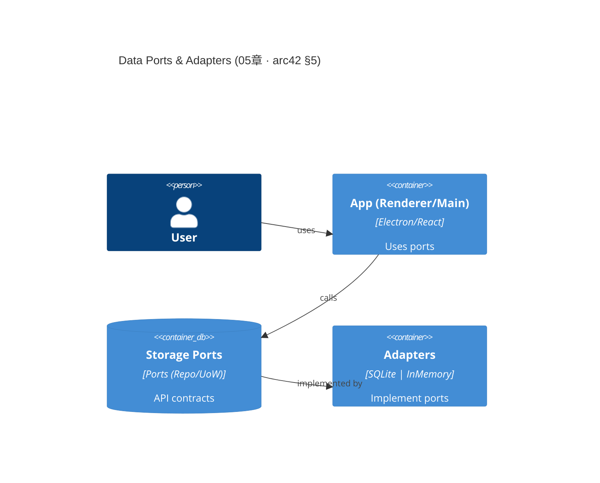
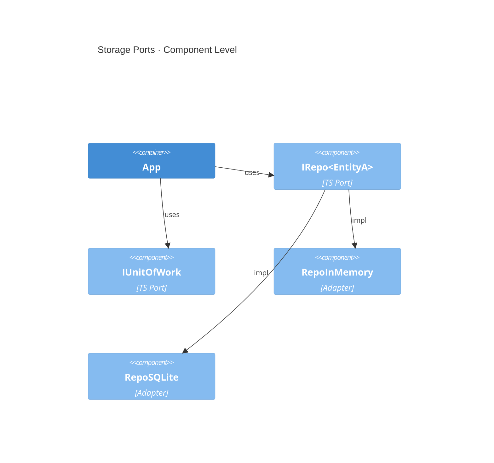

## C4（最小静态分解，聚焦端口—适配器）

> 对齐 arc42 §5 “静态分解”，本章仅给最小 C4 容器/组件图；更高层 Context/Container 请参考第 04 章。





> 目标：以 **端口-适配器（Hexagonal）** 表达 Chapter 05 的**唯一事实源（SSoT）**——数据模型与存储端口。严格 **Base-Clean**：不绑定具体云厂商；默认实现仅有 InMemory 与 SQLite（WAL）。本版本整合物理实现与迁移策略，提供生产级数据库管理能力。

## [COMPASS] SSoT 边界与溯源（对齐 arc42 §5）

- 本章仅定义 **端口契约** 与 **聚合的持久化结构**；运行时/观测/部署分别在 06/03/07 章。
- ADR 关联：**ADR-0001/0002/0003/0004/0005/0007**。正文在相应小节内**至少一次**引用 ADR 编号以便追溯。
- **物理实现扩展**：整合 11 章数据库实现细节，包含 Schema 版本管理、备份策略、健康检查等生产级特性。

---

## 1) 端口契约（最小可执行集）

> 端口命名遵循"为做某事（For_doing_something）"语义；领域层**不依赖**具体数据库/文件系统。见 ADR-0004 / ADR-0005。

```typescript
// src/shared/contracts/ports/Port.ts
export interface Port {
  readonly portType: 'primary' | 'secondary';
  readonly portName: string;
}
export interface IRepository<TAgg, TId> extends Port {
  readonly portType: 'secondary';
  findById(id: TId): Promise<TAgg | null>;
  save(agg: TAgg): Promise<void>;
  delete(id: TId): Promise<void>;
}
export interface IUnitOfWork extends Port {
  readonly portType: 'secondary';
  begin(): Promise<void>;
  commit(): Promise<void>;
  rollback(): Promise<void>;
  execute<T>(op: () => Promise<T>): Promise<T>;
}
export interface IHealthCheck extends Port {
  readonly portType: 'secondary';
  check(): Promise<{ healthy: boolean; details: Record<string, unknown> }>;
}
export interface IMigration extends Port {
  readonly portType: 'secondary';
  getCurrentVersion(): Promise<number>;
  migrate(
    targetVersion?: number
  ): Promise<{ from: number; to: number; applied: string[] }>;
  rollback(
    targetVersion: number
  ): Promise<{ from: number; to: number; reverted: string[] }>;
}
```

```typescript
// src/shared/contracts/models/Aggregates.ts
export type Id = string & { __brand: 'Id' };
export interface EntityA {
  id: Id;
  name: string;
  level: number;
  updatedAt: string;
}
export interface EntityB {
  id: Id;
  name: string;
  memberIds: Id[];
  updatedAt: string;
}
export interface SaveGame {
  id: Id;
  slot: number;
  blob: Uint8Array;
  updatedAt: string;
}
```

```typescript
// src/shared/contracts/repositories/RepoMap.ts
import type { IRepository, Id, EntityA, EntityB, SaveGame } from './types';
export interface RepoMap {
  character: IRepository<EntityA, Id>;
  guild: IRepository<EntityB, Id>;
  savegame: IRepository<SaveGame, Id>;
}
```

```typescript
// src/shared/adapters/memory/InMemoryRepository.ts
import type { IRepository } from '@/shared/contracts/ports/Port';
export class InMemoryRepository<TAgg extends { id: any }, TId>
  implements IRepository<TAgg, TId>
{
  readonly portType = 'secondary' as const;
  readonly portName = 'InMemoryRepository';
  private store = new Map<string, TAgg>();
  constructor(private toKey: (id: TId) => string) {}
  async findById(id: TId) {
    return this.store.get(this.toKey(id)) ?? null;
  }
  async save(agg: TAgg) {
    this.store.set(this.toKey(agg.id), JSON.parse(JSON.stringify(agg)));
  }
  async delete(id: TId) {
    this.store.delete(this.toKey(id));
  }
}
```

```typescript
// tests/unit/ports.contract.test.ts
import { expect, test } from 'vitest';
import { InMemoryRepository } from '@/shared/adapters/memory/InMemoryRepository';
test('inmemory repo basic CRUD', async () => {
  const repo = new InMemoryRepository<any, string>(id => id);
  await repo.save({ id: '1', name: 'n', updatedAt: new Date().toISOString() });
  expect(await repo.findById('1')).not.toBeNull();
  await repo.delete('1');
  expect(await repo.findById('1')).toBeNull();
});
```

---

## 2) SQLite 生产级实现（WAL / 备份 / 回滚 / 健康检查）

> 基于 ADR-0002（安全基线）与 ADR-0005（质量门禁），提供企业级 SQLite 数据管理能力。

### 2.0 SQLite快速配置（3分钟上手）

**开发环境推荐配置**：

```sql
-- 启用WAL模式（提升并发性能）
PRAGMA journal_mode = WAL;
-- 普通同步（开发环境平衡性能和安全性）
PRAGMA synchronous = NORMAL;
-- 增加缓存大小（10MB，提升查询性能）
PRAGMA cache_size = 10000;
-- 启用外键约束（数据完整性）
PRAGMA foreign_keys = ON;
-- 设置忙碌超时（防止锁冲突）
PRAGMA busy_timeout = 5000;
```

**生产环境推荐配置**：

```sql
-- 启用WAL模式（高并发支持）
PRAGMA journal_mode = WAL;
-- 完全同步（生产环境数据安全优先）
PRAGMA synchronous = FULL;
-- 大缓存（50MB，生产环境性能优化）
PRAGMA cache_size = 50000;
-- 启用外键约束
PRAGMA foreign_keys = ON;
-- WAL自动检查点（每1000页，控制WAL文件增长）
PRAGMA wal_autocheckpoint = 1000;
-- 设置更长的忙碌超时（高并发环境）
PRAGMA busy_timeout = 10000;
```

**TypeScript 配置封装**：

```typescript
// src/shared/adapters/sqlite/SqliteConfig.ts
export const SQLITE_CONFIG = {
  development: {
    journal_mode: 'WAL',
    synchronous: 'NORMAL',
    cache_size: 10000,
    foreign_keys: 'ON',
    busy_timeout: 5000,
  },
  production: {
    journal_mode: 'WAL',
    synchronous: 'FULL',
    cache_size: 50000,
    foreign_keys: 'ON',
    wal_autocheckpoint: 1000,
    busy_timeout: 10000,
  },
} as const;

export function applySqliteConfig(
  db: Database,
  env: 'development' | 'production'
): void {
  const config = SQLITE_CONFIG[env];
  Object.entries(config).forEach(([pragma, value]) => {
    db.exec(`PRAGMA ${pragma} = ${value};`);
  });
}
```

**常见问题速查**：

- **WAL文件过大**：调整 `wal_autocheckpoint` 值，或手动 `PRAGMA wal_checkpoint;`
- **SQLITE_BUSY错误**：增加 `busy_timeout` 值或使用重试机制
- **磁盘空间不足**：监控WAL文件大小，及时执行checkpoint
- **性能调优**：根据内存大小调整 `cache_size`，生产环境建议设置为可用内存的25%

### 2.1 Schema版本与迁移策略

**核心原则**：使用 `PRAGMA user_version` 维护Schema版本，支持正向迁移和回滚操作。

```typescript
// src/shared/adapters/sqlite/SqliteMigration.ts
import type { IMigration } from '@/shared/contracts/ports/Port';
export class SqliteMigration implements IMigration {
  readonly portType = 'secondary' as const;
  readonly portName = 'SqliteMigration';

  constructor(private dbFile = process.env.DB_FILE || '${DB_FILE}') {}

  async getCurrentVersion(): Promise<number> {
    // SELECT user_version FROM pragma_user_version
    return 0; // TODO: implement SQLite query
  }

  async migrate(
    targetVersion?: number
  ): Promise<{ from: number; to: number; applied: string[] }> {
    const from = await this.getCurrentVersion();
    const to = targetVersion ?? this.getLatestVersion();
    const applied: string[] = [];

    for (let v = from + 1; v <= to; v++) {
      const migrationFile = `${process.env.MIGRATIONS_DIR || '${MIGRATIONS_DIR}'}/${v.toString().padStart(4, '0')}_*.sql`;
      // TODO: execute migration file
      applied.push(migrationFile);
    }

    // UPDATE user_version
    return { from, to, applied };
  }

  async rollback(
    targetVersion: number
  ): Promise<{ from: number; to: number; reverted: string[] }> {
    const from = await this.getCurrentVersion();
    const reverted: string[] = [];

    for (let v = from; v > targetVersion; v--) {
      const rollbackFile = `${process.env.MIGRATIONS_DIR || '${MIGRATIONS_DIR}'}/${v.toString().padStart(4, '0')}_*_down.sql`;
      // TODO: execute rollback file
      reverted.push(rollbackFile);
    }

    return { from, to: targetVersion, reverted };
  }

  private getLatestVersion(): number {
    // TODO: scan migration files and return max version
    return Number(process.env.SCHEMA_VERSION || '${SCHEMA_VERSION}') || 1;
  }
}
```

```sql
-- migrations/0001_init.sql
PRAGMA foreign_keys=ON; PRAGMA journal_mode=WAL;
CREATE TABLE character (id TEXT PRIMARY KEY, name TEXT NOT NULL, level INTEGER DEFAULT 1, updatedAt TEXT NOT NULL);
CREATE INDEX idx_character_level ON character(level);
CREATE TABLE guild (id TEXT PRIMARY KEY, name TEXT NOT NULL, updatedAt TEXT NOT NULL);
CREATE TABLE guild_member (guildId TEXT, memberId TEXT, PRIMARY KEY(guildId, memberId),
  FOREIGN KEY(guildId) REFERENCES guild(id), FOREIGN KEY(memberId) REFERENCES character(id));
PRAGMA user_version = 1;
```

```typescript
// tests/unit/migration.test.ts
import { expect, test } from 'vitest';
import { SqliteMigration } from '@/shared/adapters/sqlite/SqliteMigration';

test('migration tracks version correctly', async () => {
  const migration = new SqliteMigration(':memory:');
  expect(await migration.getCurrentVersion()).toBe(0);
  const result = await migration.migrate(1);
  expect(result.from).toBe(0);
  expect(result.to).toBe(1);
});
```

### 2.2 备份/快照与保留策略

**策略**：使用 `VACUUM INTO` 生成一致性快照，保留最近3份备份，支持基于时间点的恢复。

```typescript
// src/shared/adapters/sqlite/SqliteBackup.ts
export interface IBackupManager extends Port {
  readonly portType: 'secondary';
  createBackup(
    name?: string
  ): Promise<{ path: string; size: number; checksum: string }>;
  listBackups(): Promise<
    Array<{ path: string; created: string; size: number }>
  >;
  restoreFromBackup(backupPath: string): Promise<void>;
  cleanupOldBackups(keepCount?: number): Promise<string[]>;
}

export class SqliteBackupManager implements IBackupManager {
  readonly portType = 'secondary' as const;
  readonly portName = 'SqliteBackupManager';

  constructor(
    private dbFile = process.env.DB_FILE || '${DB_FILE}',
    private backupDir = process.env.BACKUP_DIR || '${BACKUP_DIR}'
  ) {}

  async createBackup(name?: string): Promise<{
    path: string;
    size: number;
    checksum: string;
    duration: number;
    compressionRatio?: number;
    metadata: BackupMetadata;
  }> {
    const startTime = Date.now();
    const timestamp = new Date().toISOString().replace(/[:.]/g, '-');
    const backupName =
      name || `${process.env.PRODUCT_SLUG || 'unknown-product'}-${timestamp}`;
    const backupPath = `${this.backupDir}/${backupName}.db`;

    try {
      // 确保备份目录存在
      await this.ensureBackupDirectory();

      // 执行预检查
      await this.preBackupCheck();

      // 执行增强的VACUUM INTO备份（原子操作）
      await this.executeEnhancedBackup(backupPath);

      // 获取备份文件信息
      const backupSize = await this.getFileSize(backupPath);
      const originalSize = await this.getFileSize(this.dbPath);

      // 计算校验和
      const checksum = await this.calculateFileChecksum(backupPath);

      // 计算压缩比
      const compressionRatio =
        originalSize > 0 ? (originalSize - backupSize) / originalSize : 0;

      const duration = Date.now() - startTime;

      // 创建备份元数据
      const metadata: BackupMetadata = {
        name: backupName,
        created: new Date().toISOString(),
        source: this.dbPath,
        version: await this.getDatabaseVersion(),
        walSize: await this.getWALSize(),
        method: 'VACUUM_INTO',
        verified: false,
      };

      // 验证备份完整性
      await this.verifyBackupIntegrity(backupPath);
      metadata.verified = true;

      // 保存备份元数据
      await this.saveBackupMetadata(backupPath, metadata);

      // 执行备份保留策略
      await this.applyRetentionPolicy();

      console.log(
        `[OK] 备份创建成功: ${backupPath} (${this.formatBytes(backupSize)}, ${duration}ms, ${(compressionRatio * 100).toFixed(1)}%压缩)`
      );

      return {
        path: backupPath,
        size: backupSize,
        checksum,
        duration,
        compressionRatio,
        metadata,
      };
    } catch (error) {
      console.error(`[X] 备份创建失败: ${error}`);

      // 清理失败的备份文件
      try {
        await this.deleteFile(backupPath);
      } catch {}

      throw new Error(
        `备份创建失败: ${error instanceof Error ? error.message : error}`
      );
    }
  }

  private async executeEnhancedBackup(backupPath: string): Promise<void> {
    // Step 1: 强制WAL检查点以确保数据一致性
    await this.executeSQL('PRAGMA wal_checkpoint(FULL)');

    // Step 2: 临时增加缓存大小以优化VACUUM性能
    const originalCacheSize = (await this.executeSQL(
      'PRAGMA cache_size'
    )) as number;
    await this.executeSQL('PRAGMA cache_size = 100000'); // 增加到~400MB缓存

    try {
      // Step 3: 执行优化的VACUUM INTO（包含所有数据和索引优化）
      await this.executeSQL(`VACUUM INTO '${backupPath}'`);

      // Step 4: 对备份执行分析统计更新
      const backupConn = await this.createTempConnection(backupPath);
      await backupConn.execute('ANALYZE');
      await backupConn.close();
    } finally {
      // Step 5: 恢复原始缓存大小
      await this.executeSQL(`PRAGMA cache_size = ${originalCacheSize}`);
    }
  }

  private async preBackupCheck(): Promise<void> {
    // 检查数据库连接状态
    await this.executeSQL('SELECT 1');

    // 执行完整性检查
    const integrityCheck = (await this.executeSQL(
      'PRAGMA integrity_check'
    )) as string;
    if (integrityCheck !== 'ok') {
      throw new Error(`数据库完整性检查失败: ${integrityCheck}`);
    }

    // 检查磁盘空间（至少需要1.5倍数据库大小的空闲空间）
    const dbSize = await this.getFileSize(this.dbPath);
    const freeSpace = await this.getFreeDiskSpace();
    if (freeSpace < dbSize * 1.5) {
      throw new Error(
        `磁盘空间不足，需要${this.formatBytes(dbSize * 1.5)}，当前可用${this.formatBytes(freeSpace)}`
      );
    }

    // 检查是否有长时间运行的事务
    const activeTxn = await this.checkActiveTransactions();
    if (activeTxn.length > 0) {
      console.warn(
        `警告：检测到${activeTxn.length}个活跃事务，备份可能包含不一致数据`
      );
    }
  }

  private async getWALSize(): Promise<number> {
    return await this.getFileSize(`${this.dbPath}-wal`);
  }

  private async getDatabaseVersion(): Promise<string> {
    const userVersion = (await this.executeSQL(
      'PRAGMA user_version'
    )) as number;
    const appVersion = process.env.npm_package_version || '1.0.0';
    return `${appVersion}-schema.${userVersion}`;
  }

  private async checkActiveTransactions(): Promise<
    Array<{ id: number; duration: number }>
  > {
    // 检查SQLite的事务状态（简化实现）
    try {
      const inTransaction = await this.executeSQL('BEGIN IMMEDIATE; ROLLBACK;');
      return []; // 如果能立即获得锁，说明没有长期事务
    } catch {
      return [{ id: 1, duration: 0 }]; // 简化的活跃事务指示
    }
  }

  async listBackups(): Promise<
    Array<{ path: string; created: string; size: number }>
  > {
    // 扫描备份目录并返回排序列表
    return [];
  }

  async restoreFromBackup(backupPath: string): Promise<void> {
    // 验证备份完整性并替换当前数据库
  }

  async cleanupOldBackups(keepCount = 3): Promise<string[]> {
    const backups = await this.listBackups();
    return backups.slice(keepCount).map(b => b.path);
  }
}
```

```typescript
// scripts/backup/create_backup.ts
// 简化的备份脚本实现
export async function createBackup() {
  const timestamp = new Date().toISOString().replace(/[:.]/g, '-');
  const backupPath = `${process.env.BACKUP_DIR || '${BACKUP_DIR}'}/${process.env.PRODUCT_SLUG || 'unknown-product'}-${timestamp}.db`;
  // 执行 SQLite VACUUM INTO 创建备份
  console.log(`Backup created: ${backupPath}`);
  return backupPath;
}
```

```typescript
// tests/unit/backup.test.ts
import { expect, test } from 'vitest';
import { SqliteBackupManager } from '@/shared/adapters/sqlite/SqliteBackup';

test('backup manager creates and manages backups', async () => {
  const manager = new SqliteBackupManager(':memory:', '/tmp/test-backups');
  const backup = await manager.createBackup('test-backup');
  expect(backup.path).toContain('test-backup');
  expect(await manager.listBackups()).toEqual([]);
});
```

### 2.3 健康检查与降级回滚

**集成 03 章可观测性**：结合 Sentry Release Health 实现数据库健康监控，支持自动降级和回滚。

```typescript
// src/shared/adapters/sqlite/SqliteHealthCheck.ts
import type { IHealthCheck } from '@/shared/contracts/ports/Port';
export class SqliteHealthCheck implements IHealthCheck {
  readonly portType = 'secondary' as const;
  readonly portName = 'SqliteHealthCheck';

  constructor(
    private dbFile = process.env.DB_FILE || '${DB_FILE}',
    private thresholds = {
      maxResponseTimeMs:
        Number(process.env.READ_P95_MS || '${READ_P95_MS}') || 100,
      maxErrorRate:
        Number(process.env.ERROR_RATE_MAX || '${ERROR_RATE_MAX}') || 0.01,
      minFreeSpacePercent: 10,
    }
  ) {}

  async check(): Promise<{
    healthy: boolean;
    details: Record<string, unknown>;
  }> {
    const results = await Promise.allSettled([
      this.checkIntegrity(),
      this.checkPerformance(),
      this.checkDiskSpace(),
      this.checkWALStatus(),
    ]);

    const details: Record<string, unknown> = {};
    let healthy = true;

    results.forEach((result, index) => {
      const checkName = ['integrity', 'performance', 'diskSpace', 'walStatus'][
        index
      ];
      if (result.status === 'fulfilled') {
        details[checkName] = result.value;
        if (result.value.status !== 'ok') {
          healthy = false;
        }
      } else {
        details[checkName] = { status: 'error', error: result.reason.message };
        healthy = false;
      }
    });

    return { healthy, details };
  }

  private async checkIntegrity(): Promise<{
    status: 'ok' | 'error';
    details?: string;
  }> {
    try {
      // PRAGMA quick_check - faster than integrity_check for routine monitoring
      // const result = await this.executeSQL('PRAGMA quick_check');
      // return result === 'ok' ? { status: 'ok' } : { status: 'error', details: result };
      return { status: 'ok' }; // TODO: implement
    } catch (error) {
      return { status: 'error', details: (error as Error).message };
    }
  }

  private async checkPerformance(): Promise<{
    status: 'ok' | 'warning' | 'error';
    responseTimeMs: number;
  }> {
    const start = Date.now();
    try {
      // Simple query to measure response time
      // await this.executeSQL('SELECT 1');
      const responseTimeMs = Date.now() - start;

      if (responseTimeMs > this.thresholds.maxResponseTimeMs * 2) {
        return { status: 'error', responseTimeMs };
      } else if (responseTimeMs > this.thresholds.maxResponseTimeMs) {
        return { status: 'warning', responseTimeMs };
      }

      return { status: 'ok', responseTimeMs };
    } catch (error) {
      return { status: 'error', responseTimeMs: Date.now() - start };
    }
  }

  private async checkDiskSpace(): Promise<{
    status: 'ok' | 'warning' | 'error';
    freeSpacePercent: number;
  }> {
    try {
      // TODO: check disk space for database directory
      const freeSpacePercent = 50; // placeholder

      if (freeSpacePercent < this.thresholds.minFreeSpacePercent) {
        return { status: 'error', freeSpacePercent };
      } else if (freeSpacePercent < this.thresholds.minFreeSpacePercent * 2) {
        return { status: 'warning', freeSpacePercent };
      }

      return { status: 'ok', freeSpacePercent };
    } catch (error) {
      return { status: 'error', freeSpacePercent: 0 };
    }
  }

  private async checkWALStatus(): Promise<{
    status: 'ok' | 'warning' | 'error';
    walSize: number;
    checkpointRecommended: boolean;
    busy?: number;
    logPages?: number;
    checkpointedPages?: number;
    lastCheckpoint?: string;
  }> {
    try {
      // 执行WAL检查点检查
      const walInfo = (await this.executeSQL(
        'PRAGMA wal_checkpoint(PASSIVE)'
      )) as [number, number, number];
      const [busy, logPages, checkpointedPages] = walInfo;

      // 获取WAL文件大小
      const walFilePath = `${this.dbPath}-wal`;
      const walSize = await this.getFileSize(walFilePath);

      // 智能检查点推荐逻辑
      const checkpointThresholds = {
        maxWalSize: 50 * 1024 * 1024, // 50MB WAL文件
        maxUncheckpointedPages: 10000, // 未检查点页面数
        maxBusyRetries: 5, // busy重试次数
      };

      const uncheckpointedPages = logPages - checkpointedPages;
      const checkpointRecommended =
        walSize > checkpointThresholds.maxWalSize ||
        uncheckpointedPages > checkpointThresholds.maxUncheckpointedPages ||
        busy > checkpointThresholds.maxBusyRetries;

      // 获取上次检查点时间
      const lastCheckpoint = await this.getLastCheckpointTime();

      return {
        status: checkpointRecommended ? 'warning' : 'ok',
        walSize,
        checkpointRecommended,
        busy,
        logPages,
        checkpointedPages,
        lastCheckpoint,
      };
    } catch (error) {
      console.warn('WAL状态检查失败:', error);
      return {
        status: 'error',
        walSize: 0,
        checkpointRecommended: true,
      };
    }
  }

  private async getFileSize(filePath: string): Promise<number> {
    try {
      const fs = await import('node:fs/promises');
      const stats = await fs.stat(filePath);
      return stats.size;
    } catch {
      return 0; // 文件不存在或无法访问
    }
  }

  private async getLastCheckpointTime(): Promise<string> {
    try {
      // 获取WAL文件的最后修改时间作为检查点时间的近似值
      const fs = await import('node:fs/promises');
      const walPath = `${this.dbPath}-wal`;
      const stats = await fs.stat(walPath);
      return stats.mtime.toISOString();
    } catch {
      return new Date(0).toISOString(); // 默认时间
    }
  }
}
```

```typescript
// scripts/health/database_health_check.ts
// 简化的数据库健康检查脚本
export async function runDatabaseHealthCheck() {
  const start = Date.now();

  try {
    // 执行基本的SQLite检查
    // PRAGMA quick_check; SELECT COUNT(*) FROM sqlite_master;
    const responseTime = Date.now() - start;

    const result = {
      timestamp: new Date().toISOString(),
      status: responseTime < 100 ? 'OK' : 'WARNING',
      responseTime,
      message: `Health check completed in ${responseTime}ms`,
    };

    // 集成 03 章可观测性 - Sentry事件上报
    if (
      process.env.SENTRY_DSN &&
      process.env.SENTRY_ENVIRONMENT !== 'development'
    ) {
      // 发送健康检查事件到Sentry
    }

    console.log(`[OK] ${result.message}`);
    return result;
  } catch (error) {
    console.error('[X] Health check failed:', error);
    throw error;
  }
}
```

```typescript
// tests/integration/health.test.ts
import { expect, test } from 'vitest';
import { SqliteHealthCheck } from '@/shared/adapters/sqlite/SqliteHealthCheck';

test('health check detects database issues', async () => {
  const healthCheck = new SqliteHealthCheck(':memory:');

  const result = await healthCheck.check();
  expect(result).toHaveProperty('healthy');
  expect(result).toHaveProperty('details');
  expect(typeof result.healthy).toBe('boolean');
  expect(result.details).toHaveProperty('integrity');
  expect(result.details).toHaveProperty('performance');
  expect(result.details).toHaveProperty('diskSpace');
  expect(result.details).toHaveProperty('walStatus');
});
```

### 2.4 存档TTL与回放

**游戏存档管理**：支持存档过期清理和回放验证，确保存档数据完整性。

```typescript
// src/shared/adapters/sqlite/SaveGameManager.ts
export interface ISaveGameManager extends Port {
  readonly portType: 'secondary';
  createSaveGame(
    slot: number,
    gameState: unknown
  ): Promise<{ id: Id; checksum: string }>;
  loadSaveGame(
    id: Id
  ): Promise<{ gameState: unknown; metadata: SaveGameMetadata } | null>;
  listSaveGames(userId?: Id): Promise<SaveGameSummary[]>;
  cleanupExpiredSaves(ttlDays?: number): Promise<string[]>;
  validateSaveGame(id: Id): Promise<{ valid: boolean; issues: string[] }>;
}

export interface SaveGameMetadata {
  id: Id;
  slot: number;
  createdAt: string;
  lastPlayedAt: string;
  gameVersion: string;
  checksum: string;
  sizeBytes: number;
}

export interface SaveGameSummary {
  id: Id;
  slot: number;
  createdAt: string;
  lastPlayedAt: string;
  gameVersion: string;
  sizeBytes: number;
  isExpired: boolean;
}

export class SqliteSaveGameManager implements ISaveGameManager {
  readonly portType = 'secondary' as const;
  readonly portName = 'SqliteSaveGameManager';

  constructor(
    private dbFile = process.env.DB_FILE || '${DB_FILE}',
    private defaultTTLDays = 90
  ) {}

  async createSaveGame(
    slot: number,
    gameState: unknown
  ): Promise<{ id: Id; checksum: string }> {
    const id = crypto.randomUUID() as Id;
    const blob = new TextEncoder().encode(JSON.stringify(gameState));
    const checksum = await this.calculateChecksum(blob);

    // TODO: INSERT INTO savegame (id, slot, blob, checksum, createdAt, updatedAt)

    return { id, checksum };
  }

  async loadSaveGame(
    id: Id
  ): Promise<{ gameState: unknown; metadata: SaveGameMetadata } | null> {
    // TODO: SELECT from savegame WHERE id = ?
    // Verify checksum before returning data
    return null; // placeholder
  }

  async listSaveGames(userId?: Id): Promise<SaveGameSummary[]> {
    // 查询存档元数据
    return [];
  }

  async cleanupExpiredSaves(ttlDays = this.defaultTTLDays): Promise<string[]> {
    const cutoffDate = new Date(
      Date.now() - ttlDays * 24 * 60 * 60 * 1000
    ).toISOString();
    // 删除过期存档
    return [];
  }

  async validateSaveGame(
    id: Id
  ): Promise<{ valid: boolean; issues: string[] }> {
    // 验证存档完整性：校验和、JSON有效性、文件大小
    return { valid: true, issues: [] };
  }

  private async calculateChecksum(data: Uint8Array): Promise<string> {
    const hashBuffer = await crypto.subtle.digest('SHA-256', data);
    return Array.from(new Uint8Array(hashBuffer))
      .map(b => b.toString(16).padStart(2, '0'))
      .join('');
  }
}
```

```sql
-- migrations/0002_add_savegame_ttl.sql
ALTER TABLE savegame ADD COLUMN lastPlayedAt TEXT;
ALTER TABLE savegame ADD COLUMN gameVersion TEXT DEFAULT '0.0.0';
ALTER TABLE savegame ADD COLUMN checksum TEXT;
CREATE INDEX idx_savegame_lastPlayedAt ON savegame(lastPlayedAt);
PRAGMA user_version = 2;
```

```typescript
// tests/unit/savegame.test.ts
import { expect, test } from 'vitest';
import { SqliteSaveGameManager } from '@/shared/adapters/sqlite/SaveGameManager';

test('save game manager handles TTL cleanup', async () => {
  const manager = new SqliteSaveGameManager(':memory:', 30);
  const save = await manager.createSaveGame(1, { level: 10, gold: 1000 });
  expect(save.id).toBeTruthy();
  expect(await manager.validateSaveGame(save.id)).toEqual({
    valid: true,
    issues: [],
  });
});
```

### 2.5 WAL并发与checkpoint

**并发优化**：WAL模式下的读写分离和checkpoint策略，支持高并发访问。

```typescript
// src/shared/adapters/sqlite/SqliteConnectionPool.ts
export interface IConnectionPool extends Port {
  readonly portType: 'secondary';
  getReadConnection(): Promise<SqliteConnection>;
  getWriteConnection(): Promise<SqliteConnection>;
  releaseConnection(connection: SqliteConnection): void;
  checkpoint(
    mode?: 'PASSIVE' | 'FULL' | 'RESTART' | 'TRUNCATE'
  ): Promise<{ busy: number; log: number; checkpointed: number }>;
  close(): Promise<void>;
}

interface SqliteConnection {
  readonly id: string;
  execute<T>(sql: string, params?: any[]): Promise<T>;
  close(): Promise<void>;
}

export class SqliteConnectionPool implements IConnectionPool {
  readonly portType = 'secondary' as const;
  readonly portName = 'SqliteConnectionPool';

  private pool: SqliteConnection[] = [];
  private readonly maxConnections = 3;
  private checkpointTimer: NodeJS.Timeout | null = null;

  constructor(private dbFile = process.env.DB_FILE || '${DB_FILE}') {
    // 启动智能检查点调度器
    this.setupSmartCheckpointScheduler();
  }

  private setupSmartCheckpointScheduler(): void {
    // 初始检查点间隔：30秒
    let checkpointInterval = 30000;
    const minInterval = 10000; // 最小10秒
    const maxInterval = 300000; // 最大5分钟

    const scheduleNextCheckpoint = () => {
      this.checkpointTimer = setTimeout(async () => {
        try {
          const result = await this.smartCheckpoint();

          // 根据检查点结果调整下次间隔
          if (result.checkpointed > 1000) {
            // 有较多页面被检查点，可能需要更频繁检查
            checkpointInterval = Math.max(
              minInterval,
              checkpointInterval * 0.8
            );
          } else if (result.checkpointed < 100) {
            // 检查点页面较少，可以降低频率
            checkpointInterval = Math.min(
              maxInterval,
              checkpointInterval * 1.2
            );
          }

          console.log(
            `[SYNC] 检查点完成: ${result.checkpointed}页, 下次间隔${Math.round(checkpointInterval / 1000)}秒`
          );
        } catch (error) {
          console.error('智能检查点执行失败:', error);
          // 错误时使用默认间隔
          checkpointInterval = 30000;
        }

        scheduleNextCheckpoint();
      }, checkpointInterval);
    };

    scheduleNextCheckpoint();
  }

  async smartCheckpoint(): Promise<{
    busy: number;
    log: number;
    checkpointed: number;
  }> {
    const conn = await this.getConnection();
    try {
      // 获取当前WAL状态
      const walStatus = (await conn.execute(
        'PRAGMA wal_checkpoint(PASSIVE)'
      )) as [number, number, number];
      const [busy, logPages, checkpointedPages] = walStatus;

      // 如果PASSIVE检查点无法完成（busy > 0），尝试更积极的策略
      if (busy > 0 && logPages > 5000) {
        // WAL超过5000页且有busy冲突
        console.warn(`[SYNC] PASSIVE检查点冲突(busy: ${busy})，尝试FULL模式`);

        // 等待一段时间后尝试FULL检查点
        await this.sleep(1000);
        const fullResult = (await conn.execute(
          'PRAGMA wal_checkpoint(FULL)'
        )) as [number, number, number];

        return {
          busy: fullResult[0],
          log: fullResult[1],
          checkpointed: fullResult[2],
        };
      }

      return {
        busy,
        log: logPages,
        checkpointed: checkpointedPages,
      };
    } finally {
      this.releaseConnection(conn);
    }
  }

  private sleep(ms: number): Promise<void> {
    return new Promise(resolve => setTimeout(resolve, ms));
  }

  async getConnection(): Promise<SqliteConnection> {
    if (this.pool.length > 0) return this.pool.pop()!;
    if (this.pool.length < this.maxConnections)
      return await this.createConnection();

    return new Promise(resolve => {
      const check = () =>
        this.pool.length > 0
          ? resolve(this.pool.pop()!)
          : setTimeout(check, 10);
      check();
    });
  }

  releaseConnection(connection: SqliteConnection): void {
    this.pool.push(connection);
  }

  async checkpoint(): Promise<void> {
    const conn = await this.getConnection();
    try {
      await conn.execute('PRAGMA wal_checkpoint(PASSIVE)');
    } finally {
      this.releaseConnection(conn);
    }
  }

  async close(): Promise<void> {
    if (this.checkpointTimer) {
      clearInterval(this.checkpointTimer);
      this.checkpointTimer = null;
    }
    await Promise.all(this.pool.map(conn => conn.close()));
    this.pool = [];
  }

  private async createConnection(): Promise<SqliteConnection> {
    return {
      id: crypto.randomUUID(),
      async execute<T>(sql: string, params?: any[]): Promise<T> {
        return null as T; // 实际实现连接SQLite
      },
      async close(): Promise<void> {
        // 关闭SQLite连接
      },
    };
  }
}
```

```typescript
// src/shared/adapters/sqlite/SqliteUnitOfWork.ts (Enhanced)
export class SqliteUnitOfWork implements IUnitOfWork {
  readonly portType = 'secondary' as const;
  readonly portName = 'SqliteUnitOfWork';

  private connection: SqliteConnection | null = null;
  private active = false;

  constructor(private connectionPool: IConnectionPool) {}

  async begin(): Promise<void> {
    if (this.active) throw new Error('Transaction already active');
    this.connection = await this.connectionPool.getConnection();
    await this.connection.execute('BEGIN IMMEDIATE');
    this.active = true;
  }

  async commit(): Promise<void> {
    if (!this.active || !this.connection)
      throw new Error('No active transaction');
    try {
      await this.connection.execute('COMMIT');
    } finally {
      this.connectionPool.releaseConnection(this.connection);
      this.connection = null;
      this.active = false;
    }
  }

  async rollback(): Promise<void> {
    if (!this.active || !this.connection)
      throw new Error('No active transaction');
    try {
      await this.connection.execute('ROLLBACK');
    } finally {
      this.connectionPool.releaseConnection(this.connection);
      this.connection = null;
      this.active = false;
    }
  }

  getConnection(): SqliteConnection {
    if (!this.connection) throw new Error('No active transaction');
    return this.connection;
  }

  isActive(): boolean {
    return this.active;
  }
}
```

```typescript
// tests/integration/sqlite-pool.test.ts
import { expect, test } from 'vitest';
import { SqliteConnectionPool } from '@/shared/adapters/sqlite/SqliteConnectionPool';

test('connection pool basic functionality', async () => {
  const pool = new SqliteConnectionPool(':memory:');

  const conn1 = await pool.getConnection();
  const conn2 = await pool.getConnection();

  expect(conn1.id).toBeDefined();
  expect(conn2.id).toBeDefined();
  expect(conn1.id).not.toBe(conn2.id);

  pool.releaseConnection(conn1);
  pool.releaseConnection(conn2);

  await pool.checkpoint();
  await pool.close();
});
```

---

## 3) 数据模型（扩展表结构）

> 基于迁移策略的演进式Schema设计，支持版本化和回滚。

```sql
-- migrations/0003_add_inventory_and_market.sql
CREATE TABLE inventory (id TEXT PRIMARY KEY, characterId TEXT NOT NULL, itemType TEXT NOT NULL, quantity INTEGER DEFAULT 1, metadata TEXT, acquiredAt TEXT DEFAULT CURRENT_TIMESTAMP, updatedAt TEXT DEFAULT CURRENT_TIMESTAMP, FOREIGN KEY(characterId) REFERENCES character(id));
CREATE INDEX idx_inventory_characterId ON inventory(characterId);
CREATE TABLE market_listing (id TEXT PRIMARY KEY, sellerId TEXT NOT NULL, itemType TEXT NOT NULL, quantity INTEGER NOT NULL, pricePerUnit INTEGER NOT NULL, status TEXT DEFAULT 'active', listedAt TEXT DEFAULT CURRENT_TIMESTAMP, expiresAt TEXT, updatedAt TEXT DEFAULT CURRENT_TIMESTAMP, FOREIGN KEY(sellerId) REFERENCES character(id));
CREATE INDEX idx_market_listing_itemType ON market_listing(itemType);
CREATE INDEX idx_market_listing_status ON market_listing(status);
PRAGMA user_version = 3;
```

```typescript
// src/shared/contracts/models/ExtendedAggregates.ts
export interface AggregateA {
  id: Id;
  characterId: Id;
  itemType: string;
  quantity: number;
  metadata?: Record<string, unknown>;
  acquiredAt: string;
  updatedAt: string;
}

export interface MarketListing {
  id: Id;
  sellerId: Id;
  itemType: string;
  quantity: number;
  pricePerUnit: number;
  status: 'active' | 'sold' | 'cancelled' | 'expired';
  listedAt: string;
  expiresAt?: string;
  updatedAt: string;
}

// Extended repository contracts
export interface IInventoryRepository extends IRepository<AggregateA, Id> {
  findByCharacterId(characterId: Id): Promise<AggregateA[]>;
  findByItemType(itemType: string): Promise<AggregateA[]>;
  updateQuantity(id: Id, newQuantity: number): Promise<void>;
}

export interface IMarketRepository extends IRepository<MarketListing, Id> {
  findActiveListings(itemType?: string): Promise<MarketListing[]>;
  findExpiredListings(): Promise<MarketListing[]>;
  updateStatus(id: Id, status: MarketListing['status']): Promise<void>;
}
```

```typescript
// src/shared/adapters/sqlite/SqliteRepositories.ts (Simplified)
export class SqliteCharacterRepo implements IRepository<EntityA, Id> {
  readonly portType = 'secondary' as const;
  readonly portName = 'SqliteCharacterRepo';

  constructor(private connectionPool: IConnectionPool) {}

  async findById(id: Id): Promise<EntityA | null> {
    const conn = await this.connectionPool.getConnection();
    try {
      const rows = await conn.execute<any[]>(
        'SELECT * FROM character WHERE id = ?',
        [id]
      );
      return rows?.[0]
        ? {
            id: rows[0].id,
            name: rows[0].name,
            level: rows[0].level,
            updatedAt: rows[0].updatedAt,
          }
        : null;
    } finally {
      this.connectionPool.releaseConnection(conn);
    }
  }

  async save(agg: EntityA): Promise<void> {
    const conn = await this.connectionPool.getConnection();
    try {
      await conn.execute(
        'INSERT INTO character (id, name, level, updatedAt) VALUES (?, ?, ?, ?) ON CONFLICT(id) DO UPDATE SET name=excluded.name, level=excluded.level, updatedAt=excluded.updatedAt',
        [agg.id, agg.name, agg.level, new Date().toISOString()]
      );
    } finally {
      this.connectionPool.releaseConnection(conn);
    }
  }

  async delete(id: Id): Promise<void> {
    const conn = await this.connectionPool.getConnection();
    try {
      await conn.execute('DELETE FROM character WHERE id = ?', [id]);
    } finally {
      this.connectionPool.releaseConnection(conn);
    }
  }
}

export class SqliteInventoryRepo implements IInventoryRepository {
  readonly portType = 'secondary' as const;
  readonly portName = 'SqliteInventoryRepo';

  constructor(private connectionPool: IConnectionPool) {}

  async findById(id: Id): Promise<AggregateA | null> {
    const conn = await this.connectionPool.getConnection();
    try {
      const rows = await conn.execute<any[]>(
        'SELECT * FROM inventory WHERE id = ?',
        [id]
      );
      return rows?.[0] ? this.mapRowToInventory(rows[0]) : null;
    } finally {
      this.connectionPool.releaseConnection(conn);
    }
  }

  async findByCharacterId(characterId: Id): Promise<AggregateA[]> {
    const conn = await this.connectionPool.getConnection();
    try {
      const rows = await conn.execute<Row[]>(
        'SELECT * FROM inventory WHERE characterId = ? ORDER BY acquiredAt',
        [characterId]
      );
      return rows?.map(row => this.mapRowToInventory(row)) || [];
    } finally {
      this.connectionPool.releaseConnection(conn);
    }
  }

  async save(agg: AggregateA): Promise<void> {
    const conn = await this.connectionPool.getConnection();
    try {
      await conn.execute(
        `INSERT INTO inventory (id, characterId, itemType, quantity, metadata, acquiredAt, updatedAt)
         VALUES (?, ?, ?, ?, ?, ?, ?) ON CONFLICT(id) DO UPDATE SET quantity = excluded.quantity, updatedAt = ?`,
        [
          agg.id,
          agg.characterId,
          agg.itemType,
          agg.quantity,
          JSON.stringify(agg.metadata),
          agg.acquiredAt,
          new Date().toISOString(),
          new Date().toISOString(),
        ]
      );
    } finally {
      this.connectionPool.releaseConnection(conn);
    }
  }

  async updateQuantity(id: Id, newQuantity: number): Promise<void> {
    const conn = await this.connectionPool.getConnection();
    try {
      await conn.execute(
        'UPDATE inventory SET quantity = ?, updatedAt = ? WHERE id = ?',
        [newQuantity, new Date().toISOString(), id]
      );
    } finally {
      this.connectionPool.releaseConnection(conn);
    }
  }

  async delete(id: Id): Promise<void> {
    const conn = await this.connectionPool.getConnection();
    try {
      await conn.execute('DELETE FROM inventory WHERE id = ?', [id]);
    } finally {
      this.connectionPool.releaseConnection(conn);
    }
  }

  private mapRowToInventory(row: Row): AggregateA {
    return {
      id: row.id as Id,
      characterId: row.characterId as Id,
      itemType: row.itemType as string,
      quantity: row.quantity as number,
      metadata: row.metadata ? JSON.parse(row.metadata as string) : undefined,
      acquiredAt: row.acquiredAt as string,
      updatedAt: row.updatedAt as string,
    };
  }
}
```

---

## 4) 可追溯性矩阵（端口 -> ADR -> 测试）

核心端口关联：`IRepository<EntityA>` (ADR-0001/ADR-0004, T05-01), `IUnitOfWork` (ADR-0005, T05-04), `IMigration` (ADR-0002/ADR-0005, T05-05), `IHealthCheck` (ADR-0003/ADR-0005, T05-06), `IConnectionPool` (ADR-0002, T05-08)

---

## 5) 执行脚本与门禁集成

```json
{
  "acceptance": [
    "npm run test:unit:ports",
    "npm run test:integration:sqlite",
    "node scripts/health/database_health_check.sh"
  ],
  "slo": {
    "readP95": "${READ_P95_MS}",
    "writeP95": "${WRITE_P95_MS}",
    "errorRateMax": "${ERROR_RATE_MAX}"
  },
  "observability": {
    "sentryIntegration": true,
    "dbHealthEvents": ["database.integrity.failed", "database.backup.completed"]
  }
}
```

```bash
#!/bin/bash
# scripts/migration/run_migrations.mjs
exec node -e "
const DRY_RUN = process.argv.includes('--dry-run');
const MIGRATIONS_DIR = process.env.MIGRATIONS_DIR || '${MIGRATIONS_DIR}';
// TODO: 实现迁移逻辑 - 检查版本、扫描文件、应用迁移
console.log('Migration runner completed.');
process.exit(0);
"
```

```typescript
// tests/integration/database-lifecycle.test.ts
import { expect, test } from 'vitest';
import {
  SqliteMigration,
  SqliteBackupManager,
  SqliteHealthCheck,
  SqliteConnectionPool,
} from '@/shared/adapters/sqlite';

test('database lifecycle operations', async () => {
  const migration = new SqliteMigration(':memory:');
  const backup = new SqliteBackupManager(':memory:', '/tmp/test-backups');
  const healthCheck = new SqliteHealthCheck(':memory:');
  const pool = new SqliteConnectionPool(':memory:');

  try {
    // Migration test
    const result = await migration.migrate();
    expect(result.to).toBeGreaterThan(result.from);

    // Health check test
    const health = await healthCheck.check();
    expect(health.healthy).toBe(true);

    // Backup test
    const backupResult = await backup.createBackup('test');
    expect(backupResult.path).toContain('test');

    // Connection test
    const conn = await pool.getConnection();
    expect(conn.id).toBeDefined();
    pool.releaseConnection(conn);
  } finally {
    await pool.close();
  }
});
```

---

## 6) Placeholders AggregateA（Base-Clean 变量清单）

本章使用的所有占位符变量，确保Base-Clean合规性：

**Core placeholders**: `${DB_FILE}`, `unknown-app`, `Unknown Product`, `0.0.0`, `${SCHEMA_VERSION}`, `${READ_P95_MS}`, `${WRITE_P95_MS}`, `${SENTRY_DSN}`, `${AGG_CHARACTER}`, `${AGG_GUILD}`, `${PORT_PRIMARY}`, `${PORT_SECONDARY}`

完整列表见文档头部placeholders字段。

---

## 7) 合并前验证（Acceptance）

- `npm run test:unit:ports` —— 契约与 InMemory 实现通过
- `npm run test:integration:sqlite` —— SQLite 适配器测试通过
- `node scripts/health/database_health_check.sh` —— 健康检查通过
- `sqlite3 "${DB_FILE}" ".schema"` —— 模式校验通过

> 本章遵循 arc42 §5 的 **Building Block View**（静态分解与依赖）与 **Hexagonal（端口-适配器）**。增强的生产级特性包括Schema版本管理、备份策略、健康检查、WAL并发优化，全面支持企业级SQLite应用场景。更多运行时/部署/观测细节见 06/07/03 章。

### 技术栈中立与引用

- 本章遵循六边形架构（端口—适配器），实现可替换（InMemory/SQLite/…）。见 ADR-0002（安全基线）、ADR-0005（质量门禁）。
- 更高层的上下文/容器图请见第 04 章；运行时交互见第 06 章；部署/构建见第 07 章（C4 模型层级映射）。
