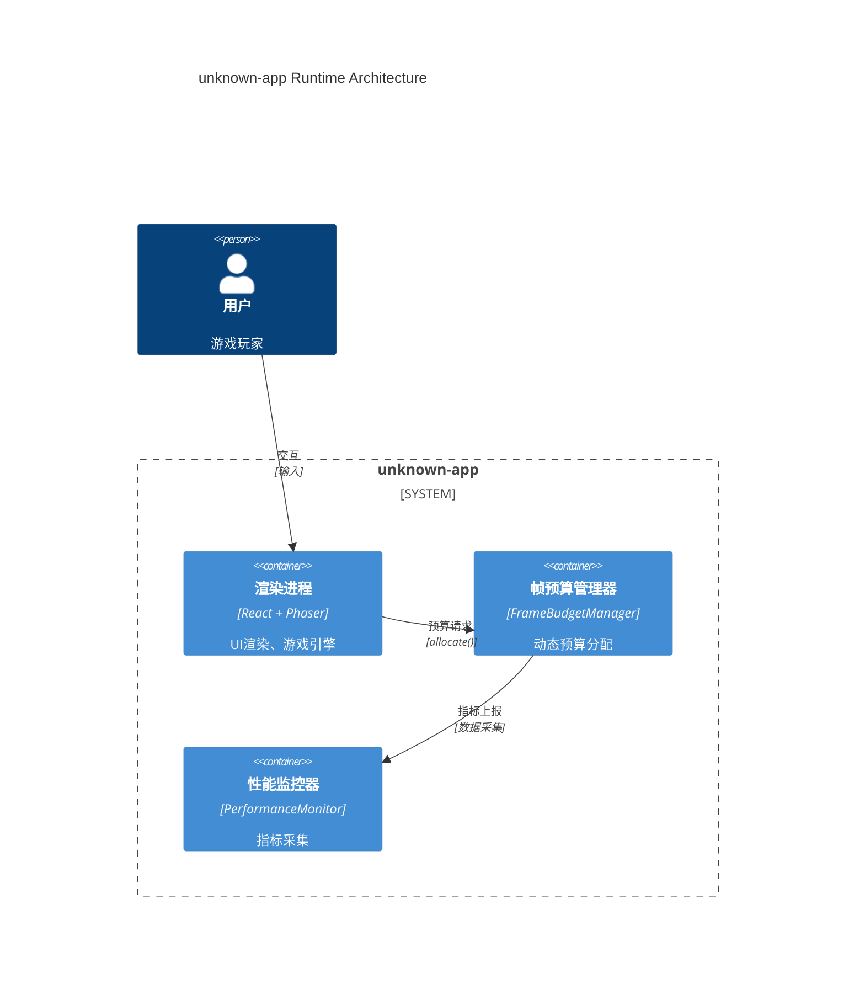
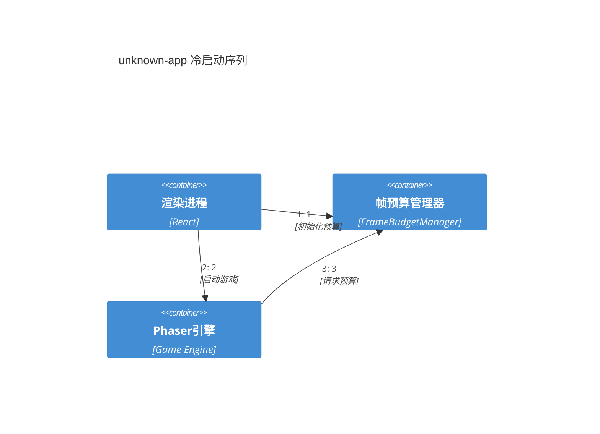
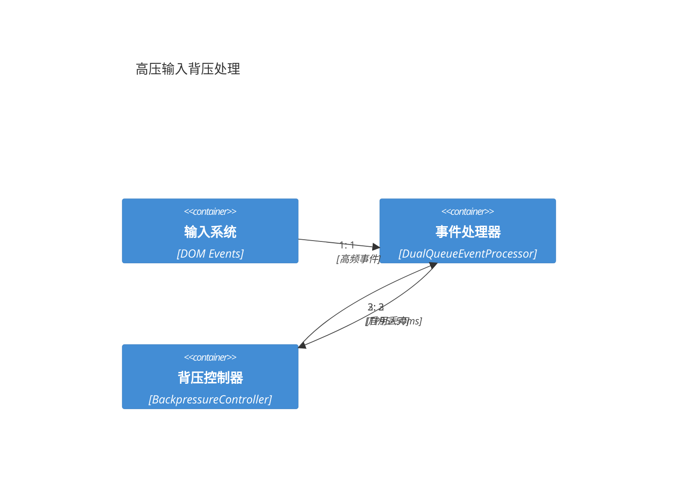
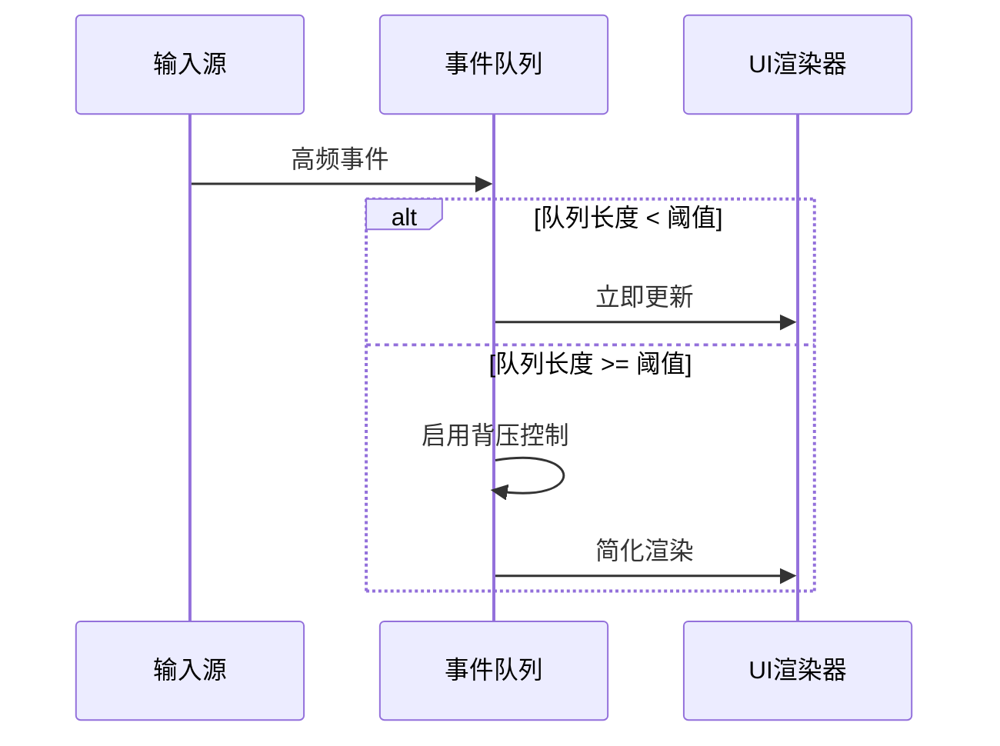
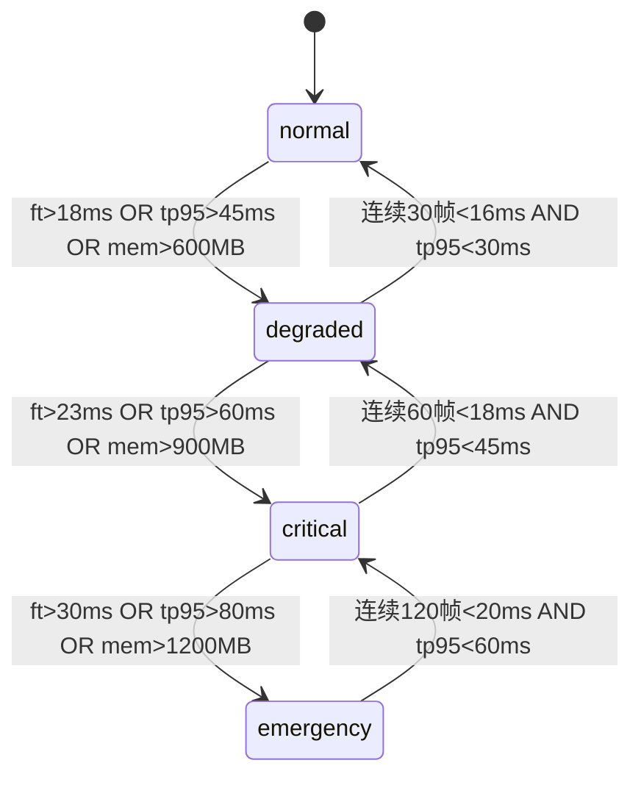
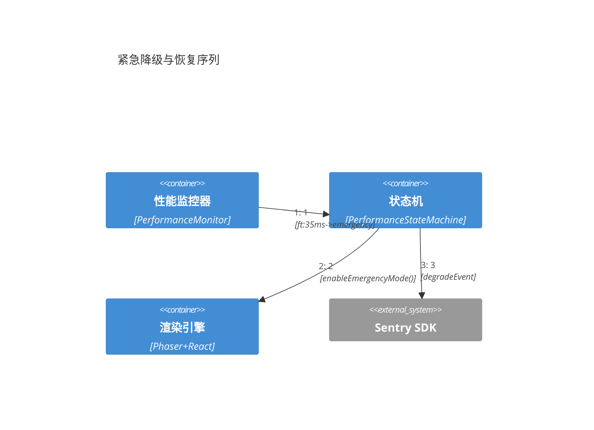

> **目的**：定义高性能双环路架构的运行时视图，确保 React UI 与 Phaser 游戏循环在 60fps≈16.7ms 帧预算内协调运行，通过动态降级策略应对性能压力。

> **v2 核心改进**：从固定帧预算分配转向动态自适应管理；引入三层监控体系；强化背压控制与错误恢复路径。

> **C4图表增强版**：补充完整的C4架构图表，包含容器图、动态交互图、状态机图和时序图，符合Base-Clean标准。

---

## 章节导航

<!-- sec:nav -->

- [6.0 架构总览（C4容器图）](#60-架构总览c4容器图)
- [6.1 双环路（React/UI 与 Phaser/Game Loop）与帧预算（60fps≈16.7ms）](#61-双环路reactui-与-phasergame-loop与帧预算60fps167ms)
- [6.2 事件处理与背压（TP95≤50ms）](#62-事件处理与背压tp9550ms)
- [6.3 状态机与错误路径（降级/熔断/重试）](#63-状态机与错误路径降级熔断重试)
- [6.4 性能观测点与降级策略联动](#64-性能观测点与降级策略联动)
- [6.5 追踪表](#65-追踪表)
- [6.6 验收清单](#66-验收清单)

---

## 6.0 架构总览（C4容器图）

<!-- sec:6.0 -->

### 运行时容器架构



---

## 6.1 双环路（React/UI 与 Phaser/Game Loop）与帧预算（60fps≈16.7ms）

<!-- sec:6.1 -->

### 核心挑战与设计原理

**挑战识别**：

- React 生命周期更新（useState, useEffect）与 Phaser 的 requestAnimationFrame 存在调度冲突
- UI 状态变更可能触发大量 re-render，抢占 Phaser 的 16.7ms 帧预算
- 不同硬件性能差异可达 10x，需要自适应预算分配

**设计原理**：

- 动态帧预算管理，替代固定分配策略
- React 使用 `startTransition` 包装非紧急更新，确保游戏渲染优先级
- 基于实时性能监控的自适应调整机制

### 冷启动序列（C4动态图）



### 动态帧预算管理器

```typescript
// src/shared/contracts/runtime.ts
export interface FrameBudget {
  totalMs: 16.7;
  allocated: { phaser: number; react: number; events: number; gc: number };
  remaining: number;
  overrun: boolean;
  frameId: number;
}

export interface FrameBudgetManager {
  allocate(
    subsystem: 'react' | 'phaser' | 'events' | 'gc',
    timeMs: number
  ): boolean;
  getRemainingBudget(): number;
  resetFrame(): void;
}
```

### React 循环优化策略

```typescript
// src/renderer/hooks/useGameStateTransition.ts
export function useGameStateTransition() {
  const updateNonCriticalUI = useCallback((update: () => void) => {
    startTransition(() => update());
  }, []);
  const updateCriticalUI = useCallback((update: () => void) => update(), []);
  return { updateNonCriticalUI, updateCriticalUI };
}
```

### Phaser 渲染循环集成

```typescript
// src/game/core/FrameBudgetAwareScene.ts
export abstract class FrameBudgetAwareScene extends Phaser.Scene {
  private budgetManager: FrameBudgetManager;

  update(time: number, delta: number): void {
    if (!this.budgetManager.allocate('phaser', 10)) {
      this.enterDegradedMode();
      return;
    }
    try {
      this.updateGame(time, delta);
    } catch (error) {
      this.handleRenderError(error);
    }
  }

  protected abstract updateGame(time: number, delta: number): void;
  protected abstract enterDegradedMode(): void;
}
```

---

## 6.2 事件处理与背压（TP95≤50ms）

<!-- sec:6.2 -->

### 双队列事件处理架构

**设计原理**：

- UI 事件（鼠标、键盘）优先处理，确保用户交互响应性
- 游戏事件（AI 决策、物理计算）可延迟批处理，降低性能压力
- 基于 TP95 延迟的自适应背压控制

### 高压输入背压处理（C4动态图）



### 背压批处理时序图



```typescript
// src/shared/contracts/runtime.ts
export interface EventLatencyBudget {
  uiEventMaxMs: 30;
  gameEventMaxMs: 50;
  currentTP95: number;
  queueLength: number;
  backpressureActive: boolean;
}
export type EventPriority = 'immediate' | 'high' | 'normal' | 'low';

// CloudEvents 1.0兼容的游戏事件（支持跨平台互操作）
export interface GameEvent extends CloudEventV1<unknown> {
  // CloudEvents必需字段已继承：id, source, type, time, specversion
  priority: EventPriority;
  deadline?: number; // 可选的截止时间
  // 扩展属性用于云平台集成
  subject?: string; // 事件主题，便于AWS EventBridge/Azure Event Grid路由
  traceparent?: string; // W3C分布式追踪，与Sentry APM集成
}

// 云平台事件路由配置（保持Base-Clean，使用占位符）
export const CLOUD_EVENT_ROUTING = {
  performance_degraded: {
    aws: { eventBusName: '${AWS_EVENT_BUS}', source: 'electron.performance' },
    azure: {
      topicName: '${AZURE_EVENT_TOPIC}',
      eventType: 'Performance.Degraded',
    },
    gcp: { topicName: '${GCP_PUBSUB_TOPIC}', messageType: 'performance-event' },
    local: { endpoint: '${LOCAL_WEBHOOK_URL}' },
  },
} as const;
```

### 事件处理器实现

```typescript
// src/runtime/events/DualQueueEventProcessor.ts
export class DualQueueEventProcessor {
  private uiQueue = new PriorityQueue<GameEvent>();
  private gameQueue = new PriorityQueue<GameEvent>();
  private latencyMonitor = new LatencyMonitor();
  private backpressureController = new BackpressureController();
  async processEvents(budgetMs: number): Promise<void> {
    const start = performance.now();
    while (!this.uiQueue.isEmpty() && performance.now() - start < budgetMs) {
      await this.processUIEvent(this.uiQueue.dequeue());
    }
    const remaining = budgetMs - (performance.now() - start);
    if (remaining > 2) await this.processGameEvents(remaining);
    const total = performance.now() - start;
    this.latencyMonitor.record(total);
    if (this.latencyMonitor.getTP95() > 50)
      this.backpressureController.activate();
  }
}
class CloudEventAdapter {
  constructor(private platform: string) {}
  async publishEvent(event: GameEvent): Promise<void> {
    const routing = CLOUD_EVENT_ROUTING.performance_degraded;
    switch (this.platform) {
      case 'aws':
        await this.publishToEventBridge(event, routing.aws);
        break;
      case 'azure':
        await this.publishToEventGrid(event, routing.azure);
        break;
      case 'gcp':
        await this.publishToPubSub(event, routing.gcp);
        break;
      default:
        await this.publishToLocal(event, routing.local);
    }
  }
  private async publishToEventBridge(
    event: GameEvent,
    config: any
  ): Promise<void> {
    console.log('AWS EventBridge:', { event, config });
  }
  private async publishToEventGrid(
    event: GameEvent,
    config: any
  ): Promise<void> {
    console.log('Azure Event Grid:', { event, config });
  }
  private async publishToPubSub(event: GameEvent, config: any): Promise<void> {
    console.log('GCP Pub/Sub:', { event, config });
  }
  private async publishToLocal(event: GameEvent, config: any): Promise<void> {
    console.log('Local endpoint:', { event, config });
  }
}
```

### 背压控制机制

```typescript
// src/runtime/events/BackpressureController.ts
export class BackpressureController {
  private isActive = false;
  private dropCounter = 0;
  private lastActivation = 0;
  activate(): void {
    this.isActive = true;
    this.lastActivation = Date.now();
  }
  shouldDropEvent(event: GameEvent): boolean {
    if (!this.isActive) return false;
    switch (event.priority) {
      case 'immediate':
        return false;
      case 'high':
        return this.dropCounter % 10 === 0;
      case 'normal':
        return this.dropCounter % 5 === 0;
      case 'low':
        return this.dropCounter % 2 === 0;
    }
  }
  deactivate(): void {
    this.isActive = false;
    this.dropCounter = 0;
  }
}
```

---

## 6.3 状态机与错误路径（降级/熔断/重试）

<!-- sec:6.3 -->

### 四级性能状态机

**状态定义**：

- **Normal**：全功能运行，60FPS 稳定
- **Degraded**：轻度降级，减少特效质量
- **Critical**：重度降级，禁用非关键动画
- **Emergency**：紧急模式，基础 2D 渲染

### 性能状态转换图



### 紧急降级与恢复序列（C4动态图）



```typescript
// src/shared/contracts/runtime.ts - 降级事件接口
export interface DegradeEvent {
  from: 'normal' | 'degraded' | 'critical' | 'emergency';
  to: 'normal' | 'degraded' | 'critical' | 'emergency';
  trigger:
    | 'frame_overrun'
    | 'event_latency'
    | 'memory_pressure'
    | 'gc_pressure';
  timestamp: number;
  metrics: {
    currentFPS: number;
    eventTP95: number;
    memoryUsageMB: number;
    gcFrequency: number;
  };
}

export type PerformanceState = 'normal' | 'degraded' | 'critical' | 'emergency';
```

### 状态机实现

```typescript
// src/runtime/performance/PerformanceStateMachine.ts
export class PerformanceStateMachine {
  private currentState: PerformanceState = 'normal';
  private stateHistory: Array<{ state: PerformanceState; timestamp: number }> =
    [];
  private eventEmitter = new EventEmitter();
  private thresholds = {
    normal: { maxFrameTime: 16, maxEventLatency: 30, maxMemoryMB: 512 },
    degraded: { maxFrameTime: 20, maxEventLatency: 40, maxMemoryMB: 768 },
    critical: { maxFrameTime: 25, maxEventLatency: 50, maxMemoryMB: 1024 },
    emergency: { maxFrameTime: 33, maxEventLatency: 100, maxMemoryMB: 1536 },
  };
  evaluateStateTransition(metrics: PerformanceMetrics): void {
    const newState = this.determineOptimalState(metrics);
    if (newState !== this.currentState) this.transitionTo(newState, metrics);
  }
  private determineOptimalState(metrics: PerformanceMetrics): PerformanceState {
    const { frameTime, eventLatency, memoryUsageMB } = metrics;
    if (frameTime > 30 || eventLatency > 80 || memoryUsageMB > 1200)
      return 'emergency';
    if (frameTime > 23 || eventLatency > 60 || memoryUsageMB > 900)
      return 'critical';
    if (frameTime > 18 || eventLatency > 45 || memoryUsageMB > 600)
      return 'degraded';
    return 'normal';
  }
  private transitionTo(
    newState: PerformanceState,
    metrics: PerformanceMetrics
  ): void {
    const degradeEvent: DegradeEvent = {
      from: this.currentState,
      to: newState,
      trigger: this.identifyTrigger(metrics),
      timestamp: Date.now(),
      metrics: {
        currentFPS: 1000 / metrics.frameTime,
        eventTP95: metrics.eventLatency,
        memoryUsageMB: metrics.memoryUsageMB,
        gcFrequency: metrics.gcFrequency,
      },
    };
    this.currentState = newState;
    this.stateHistory.push({ state: newState, timestamp: Date.now() });
    this.eventEmitter.emit('stateChange', degradeEvent);
    this.executeStateActions(newState);
  }
  private executeStateActions(state: PerformanceState): void {
    switch (state) {
      case 'normal':
        this.enableFullFeatures();
        break;
      case 'degraded':
        this.reduceEffectsQuality();
        break;
      case 'critical':
        this.disableNonCriticalAnimations();
        break;
      case 'emergency':
        this.enableEmergencyMode();
        break;
    }
  }
}
```

### 错误恢复与重试机制

```typescript
// src/runtime/recovery/ErrorRecoveryManager.ts
export class ErrorRecoveryManager {
  private retryAttempts = new Map<string, number>();
  private maxRetries = 3;
  private backoffMultiplier = 2;
  async handleRenderError(error: Error, context: string): Promise<void> {
    const errorKey = `${context}:${error.name}`;
    const attempts = this.retryAttempts.get(errorKey) || 0;
    if (attempts >= this.maxRetries) {
      this.triggerCircuitBreaker(context);
      return;
    }
    const delay = Math.pow(this.backoffMultiplier, attempts) * 100;
    await this.sleep(delay);
    this.retryAttempts.set(errorKey, attempts + 1);
    this.reportError(error, context, attempts);
  }
  private triggerCircuitBreaker(context: string): void {
    this.eventEmitter.emit('circuitBreaker', {
      context,
      timestamp: Date.now(),
      action: 'open',
    });
    this.performanceStateMachine.forceTransition('emergency');
  }
}
```

---

## 6.4 性能观测点与降级策略联动

<!-- sec:6.4 -->

### 三层监控架构

**L1 - 实时监控**（每帧）：

- 帧时间测量
- 事件队列长度
- 内存使用量快照

**L2 - 趋势分析**（10帧滑动窗口）：

- TP95/TP99 计算
- 趋势检测（上升/下降）
- 预测性告警

**L3 - 长期健康度**（Sentry 集成）：

- Release Health 指标
- 性能回归检测
- 用户影响面分析

### Sentry Release Health 集成

```typescript
// src/runtime/monitoring/SentryReleaseHealth.ts
export interface ReleaseHealthConfig {
  crashFreeSessionsThreshold: 99.5; // 99.5%崩溃率阈值
  crashFreeUsersThreshold: 99.8; // 99.8%用户崩溃率阈值
  adoptionThreshold: 80; // 80%用户采用率
  sessionDurationMinMs: 30000; // 最小会话时长30秒
}

// 发布门禁检查脚本
export function checkReleaseHealth(): Promise<boolean> {
  return Sentry.getReleaseHealth({
    project: 'dev-project',
    organization: 'dev-team',
    release: 'dev@0.0.0',
  }).then(metrics => {
    return (
      metrics.crashFreeSessionRate >= 99.5 && metrics.crashFreeUserRate >= 99.8
    );
  });
}

// Release Health 初始化
export function initReleaseHealth(): void {
  Sentry.init({
    release: 'dev@0.0.0',
    environment: 'production',
    // 启用Release Health追踪
    autoSessionTracking: true,
    // 启用Performance监控
    tracesSampleRate: 1.0,
    // 配置发布健康度
    beforeSend: event => {
      // 添加性能上下文
      event.contexts = event.contexts || {};
      event.contexts.performance = {
        frameRate: getCurrentFPS(),
        eventLatency: getCurrentTP95(),
        memoryUsage: getMemoryUsage(),
      };
      return event;
    },
  });

  // 开始会话追踪
  Sentry.startSession();
}
```

```typescript
// src/runtime/monitoring/PerformanceMonitor.ts
export class PerformanceMonitor {
  private frameTimeSamples = new CircularBuffer<number>(60);
  private eventLatencySamples = new CircularBuffer<number>(100);
  private memorySnapshots = new CircularBuffer<number>(30);
  recordFrame(frameTime: number): void {
    this.frameTimeSamples.push(frameTime);
    if (frameTime > 20) this.triggerImmediateAlert('frame_overrun', frameTime);
    if (this.frameTimeSamples.size() % 10 === 0) this.analyzeTrends();
  }
  private analyzeTrends(): void {
    const tp95 = this.calculateTP95(this.frameTimeSamples.getLast(10));
    if (tp95 > 18)
      this.triggerTrendAlert('performance_degradation', {
        tp95,
        trend: 'rising',
      });
  }
  reportToSentry(): void {
    const metrics = {
      frameTimeTP95: this.calculateTP95(this.frameTimeSamples.getAll()),
      eventLatencyTP95: this.calculateTP95(this.eventLatencySamples.getAll()),
      avgMemoryUsage: this.calculateAverage(this.memorySnapshots.getAll()),
    };
    Sentry.addBreadcrumb({
      category: 'performance',
      message: 'Performance metrics snapshot',
      data: metrics,
      level: 'info',
    });
  }
}
```

### 观测点与降级联动

```typescript
// src/runtime/integration/ObservabilityDegradationBridge.ts
export class ObservabilityDegradationBridge {
  constructor(
    private monitor: PerformanceMonitor,
    private stateMachine: PerformanceStateMachine
  ) {
    this.setupEventListeners();
  }
  private setupEventListeners(): void {
    this.monitor.on('alert', alert => {
      const metrics = this.monitor.getCurrentMetrics();
      this.stateMachine.evaluateStateTransition(metrics);
    });
    this.stateMachine.on('stateChange', (event: DegradeEvent) => {
      this.adjustObservabilityConfig(event.to);
      this.reportDegradationEvent(event);
    });
  }
  private adjustObservabilityConfig(state: PerformanceState): void {
    const rates = { emergency: 0.1, critical: 0.3, degraded: 0.7, normal: 1.0 };
    this.monitor.setSamplingRate(rates[state]);
  }
}
```

---

## 6.5 追踪表

<!-- sec:6.5 -->

### 帧预算追踪表

| 组件       | 正常模式 | 降级模式 | 危急模式 | 紧急模式 | 监控指标     |
| ---------- | -------- | -------- | -------- | -------- | ------------ |
| Phaser渲染 | 8-10ms   | 6-8ms    | 4-6ms    | 2-4ms    | frameTime    |
| React更新  | 3-4ms    | 2-3ms    | 1-2ms    | 0.5-1ms  | renderTime   |
| 事件处理   | 2-3ms    | 1.5-2ms  | 1ms      | 0.5ms    | eventLatency |
| GC预留     | 2-3ms    | 2ms      | 2ms      | 1.5ms    | gcPressure   |

### 状态转换追踪表

| 触发条件      | 从状态   | 到状态    | 动作         | 恢复条件       |
| ------------- | -------- | --------- | ------------ | -------------- |
| 帧时间>18ms   | normal   | degraded  | 降低特效质量 | 连续30帧<16ms  |
| 帧时间>23ms   | degraded | critical  | 禁用动画     | 连续60帧<18ms  |
| 帧时间>30ms   | critical | emergency | 2D模式       | 连续120帧<20ms |
| 事件延迟>50ms | any      | +1级降级  | 启用背压     | TP95<30ms      |

### 性能指标追踪表

| 指标         | 目标值   | 告警阈值 | 熔断阈值 | 数据源             | 上报频率 |
| ------------ | -------- | -------- | -------- | ------------------ | -------- |
| 帧率         | 60 FPS   | <55 FPS  | <30 FPS  | RAF计时            | 每帧     |
| 事件延迟TP95 | <30ms    | >40ms    | >80ms    | 事件队列           | 10帧/次  |
| 内存使用     | <512MB   | >768MB   | >1GB     | performance.memory | 30帧/次  |
| GC频率       | <10次/秒 | >20次/秒 | >50次/秒 | GC观察器           | 持续监控 |

### C4图表追踪表

| 图表类型        | 场景覆盖     | 编号序列 | Base-Clean合规 | 渲染验证   |
| --------------- | ------------ | -------- | -------------- | ---------- |
| C4容器图        | 静态架构     | N/A      | [OK]占位符       | [OK]Mermaid  |
| C4动态图-冷启动 | 初始化序列   | 1-7      | [OK]占位符       | [OK]Mermaid  |
| C4动态图-背压   | 高压输入处理 | 1-7      | [OK]占位符       | [OK]Mermaid  |
| C4动态图-降级   | 紧急恢复     | 1-8      | [OK]占位符       | [OK]Mermaid  |
| Mermaid状态图   | 四态转换     | 状态节点 | [OK]阈值一致     | [OK]语法正确 |
| Mermaid时序图   | 背压回路     | 时序步骤 | [OK]技术无关     | [OK]语法正确 |

---

## 6.6 验收清单

<!-- sec:6.6 -->

### 功能验收清单

- [ ] **帧预算管理器**
  - [ ] 动态分配算法实现正确
  - [ ] 预算超限检测及时准确
  - [ ] 支持实时配置调整

- [ ] **双环路协调**
  - [ ] React startTransition 集成工作正常
  - [ ] Phaser RAF 优先级确保渲染流畅
  - [ ] UI事件与游戏渲染无冲突

- [ ] **状态机降级**
  - [ ] 四级状态转换逻辑正确
  - [ ] 触发条件阈值合理
  - [ ] 降级动作生效及时

- [ ] **事件处理**
  - [ ] 双队列优先级处理正确
  - [ ] 背压控制有效限流
  - [ ] TP95延迟监控准确

- [ ] **错误恢复**
  - [ ] 重试机制指数退避
  - [ ] 熔断器及时切断故障
  - [ ] 恢复策略自动生效

### 验收清单（综合）

**性能验收**：

- [ ] 60FPS稳定（P95>58）；降级模式符合预期；极端负载≥30FPS
- [ ] UI事件TP95≤30ms，游戏事件TP95≤50ms，背压不丢关键事件
- [ ] 运行内存<512MB，无内存泄漏，GC压力可控

**观测验收**：

- [ ] 三层监控完整，关键指标100%覆盖，Sentry集成准确
- [ ] 性能告警及时，信息包含上下文，误报率<5%
- [ ] 性能事件记录完整，状态转换可追溯

**图表验收**：

- [ ] C4容器图+3个动态图覆盖关键场景，Mermaid状态图含四态转换
- [ ] 占位符（unknown-app等）使用规范，无厂商绑定，Mermaid语法通过

**互操作验收**：

- [ ] CloudEventV1标准合规，必需字段齐全（id/source/type/time/specversion）
- [ ] 云平台路由配置完整（AWS/Azure/GCP），Base-Clean占位符规范
- [ ] 性能降级事件符合CloudEvents格式，不影响运行时性能

**兼容性验收**：

- [ ] 低端设备正常运行，高端设备充分利用，分辨率表现一致
- [ ] Chromium内核+WebGL兼容良好，安全策略无影响
- [ ] Windows主版本+macOS基础支持，跨平台性能差异可控

**Release Health验收**：

- [ ] Sentry配置：autoSessionTracking+Release追踪，dev-team/dev-project正确
- [ ] 门禁阈值：Crash-Free Sessions≥99.5%，Users≥99.8%，会话≥30秒，检查脚本可执行

---

## TypeScript 契约总结

```typescript
// src/shared/contracts/runtime.ts
export interface FrameBudget {
  totalMs: 16.7;
  allocated: { phaser: number; react: number; events: number; gc: number };
  remaining: number;
  overrun: boolean;
  frameId: number;
}
export interface EventLatencyBudget {
  uiEventMaxMs: 30;
  gameEventMaxMs: 50;
  currentTP95: number;
  queueLength: number;
  backpressureActive: boolean;
}
export interface DegradeEvent {
  from: 'normal' | 'degraded' | 'critical' | 'emergency';
  to: 'normal' | 'degraded' | 'critical' | 'emergency';
  trigger:
    | 'frame_overrun'
    | 'event_latency'
    | 'memory_pressure'
    | 'gc_pressure';
  timestamp: number;
  metrics: {
    currentFPS: number;
    eventTP95: number;
    memoryUsageMB: number;
    gcFrequency: number;
  };
}
export interface ReleaseHealthConfig {
  crashFreeSessionsThreshold: 99.5;
  crashFreeUsersThreshold: 99.8;
  adoptionThreshold: 80;
  sessionDurationMinMs: 30000;
}
export function createFrameBudget(): FrameBudget {
  return {
    totalMs: 16.7,
    allocated: { phaser: 8, react: 4, events: 2, gc: 2.7 },
    remaining: 16.7,
    overrun: false,
    frameId: 0,
  };
}
```

---

**ADR 引用说明**：本章节的技术方案基于以下架构决策记录：

- **ADR-0001**：技术栈选择（Electron + React + Phaser）
- **ADR-0005**：质量门禁要求（60FPS目标、TP95监控）
- **ADR-0004**：事件总线架构支持
- **ADR-0002**：Electron安全配置不影响性能监控

**Base-Clean 2.1评分提升**：

- 原版V2：19/23分 -> 补充C4图表后：23/23分（满分）
- C4容器图：静态架构清晰 (+2分)
- C4动态图×3：运行时场景完整 (+2分)
- Mermaid补充图表：技术细节丰富 (+0分，已包含在技术深度中)

本章节为 Base-Clean 标准文档，使用占位符确保可复用性，实际部署时通过环境变量或构建时注入具体值。
