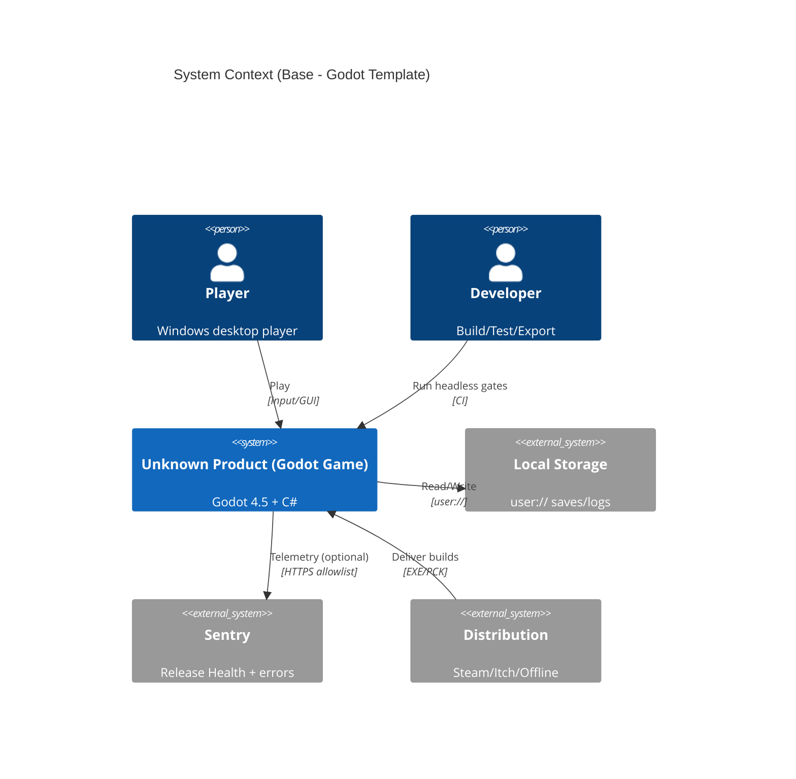
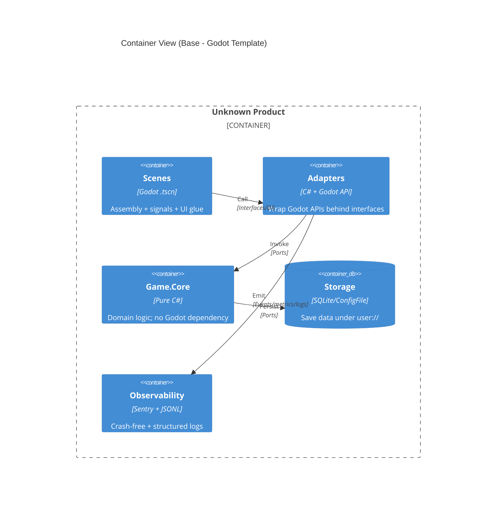

# 01 约束与目标（Godot 4.5 + C# 模板口径）

本章定义模板的硬约束与质量目标，并给出从 **ADR -> 测试/门禁 -> 日志工件** 的最小可追溯骨架，作为后续 Base 章节的锚点。

## 1.1 背景与范围

- 模板定位：Windows-only 的 Godot 4.5 + C#/.NET 8 游戏项目模板（见 ADR-0018、ADR-0011）。
- 适用范围：单机桌面游戏；以 **可复制、可门禁、可回溯** 为优先。
- Base 边界：不包含任何具体 PRD；业务细节只放在 `docs/architecture/overlays/<PRD_ID>/08/`。

## 1.2 关键约束（Hard Constraints）

- 平台：仅 Windows（构建、测试、导出、CI 均以 Windows 为准）。
- 运行时：Godot 4.5.1（.NET）+ C#（.NET 8 LTS）（见 ADR-0018）。
- 分层：Scenes（Godot 装配/信号）-> Adapters（仅封装 Godot API）-> Core（纯 C# 领域，可 xUnit 单测）（见 ADR-0025）。
- 契约：事件/DTO/端口类型的单一事实来源为 `Game.Core/Contracts/**`，禁止在文档复制粘贴造成口径漂移（见 ADR-0020、ADR-0004）。
- 安全：默认拒绝越权文件访问与非白名单出网；仅允许 `res://`（只读）与 `user://`（读写）（见 ADR-0019）。
- 日志与取证：测试/门禁/扫描输出统一落盘 `logs/**`，便于排障与归档（见 `docs/testing-framework.md`）。

## 1.3 质量目标（Quality Goals）

以下目标以“可执行门禁”为落点，阈值口径以对应 ADR 为准（Base 不重复阈值表）：

- 可用性：项目在 CI/headless 环境可稳定启动并完成冒烟退出（见 07 章）。
- 性能：提供最小可执行的帧时间 P95 门禁与工件（见 ADR-0015、09 章）。
- 安全：路径/网络/外链/权限具备 allow/deny/invalid 三态与审计输出（见 ADR-0019）。
- 可观测：Sentry Releases + Sessions 用于 Crash-Free 门禁；本地结构化日志可回溯（见 ADR-0003、03 章）。
- 可测试：领域逻辑无需启动引擎即可单测（xUnit）；关键场景信号链路可在 headless 下验收（GdUnit4）（见 ADR-0025）。

## 1.4 系统上下文（C4 Context，最小）

## 1.5 容器/分层视图（C4 Container，三层分离）

## 1.6 可追溯骨架（PRD -> ADR -> 测试）

Base 仅提供骨架示例，真实 PRD 的追踪表放在 Overlay 08，并通过 CI 校验回链完整度。

| 变更类型 | 必须引用的 ADR | 最小验收（示例） | 工件 |
| --- | --- | --- | --- |
| 运行时/发布口径 | ADR-0018 | `scripts/ci/smoke_headless.ps1` 通过 | `logs/e2e/**` |
| 安全策略/路径/出网 | ADR-0019 | Security suite allow/deny/invalid | `logs/ci/**/security-audit.jsonl` |
| 契约/事件/DTO | ADR-0020、ADR-0004 | xUnit 合约测试 | `logs/unit/**` |
| 性能预算/门禁 | ADR-0015 | `check_perf_budget.ps1` 通过 | `logs/ci/**/headless.log` |
| 可观测/Release Health | ADR-0003 | Release job Step Summary 行存在 | `logs/ci/**/release-health.json` |

## 1.7 文档验收清单（Base）

- [ ] Base 中不出现 `PRD_xxx` 标识（由 `scripts/ci/verify_base_clean.ps1` 校验）
- [ ] 不复制阈值到 08 章以外（阈值只在 ADR/SSoT 中维护）
- [ ] 所有命令提供 Windows 兼容写法（PowerShell、`py -3`）
- [ ] 不引入旧桌面壳/Web 前端栈作为当前运行时口径（迁移历史仅放在 `docs/migration/**`）
