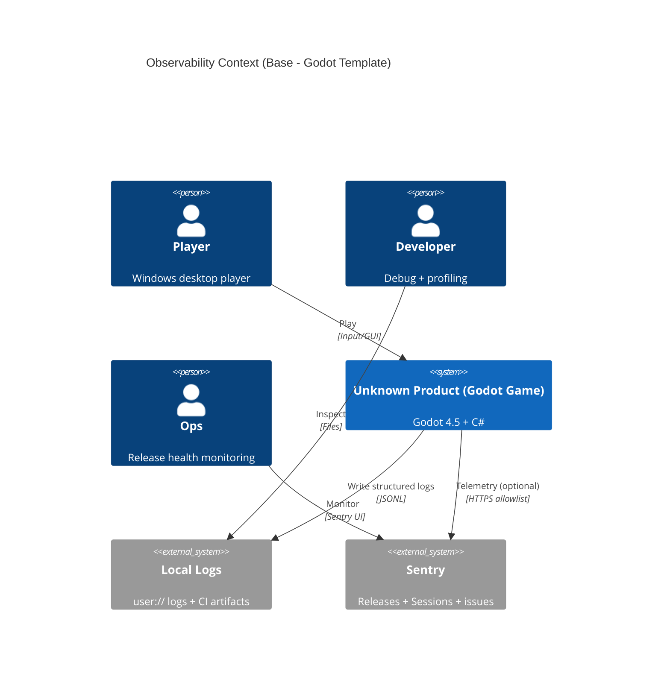

# 03 可观测性与发布健康（Sentry + 结构化日志）

本章给出 Godot 模板的最小可观测骨架：本地结构化日志、Sentry Secrets 软门禁、Release Health 口径引用与工件落盘路径。

## 0. 章节定位（与 arc42 §3 对齐）

- 目标：让“问题可回溯、可对比、可门禁”，并让 CI 产物可直接用于排障。
- 口径：Release Health（Crash-Free）以 ADR-0003 为准；安全与隐私约束以 ADR-0019 为准。
- 约束：Windows-only（ADR-0011），所有可执行步骤提供 PowerShell/`py -3` 写法。

## 1) 上下文视图（C4 Context，最小）

## 2) 日志策略（结构化 + 可归档）

- 引擎侧运行时日志：优先写入 `user://logs/**`（由 Godot 映射到用户目录）。
- CI 侧门禁与测试工件：统一写入 `logs/**`（例如 `logs/ci/<YYYY-MM-DD>/...`、`logs/e2e/<YYYY-MM-DD>/...`）。
- 格式建议：JSONL（逐行 JSON），便于增量写入与 grep/解析。

## 3) Sentry（Secrets 软门禁 + Step Summary）

模板默认不要求在本地具备 Sentry Secrets；Release 工作流中通过软门禁输出一行可审计结论：

- 脚本：`scripts/python/check_sentry_secrets.py`
- 输出行：`Sentry: secrets_detected=<true|false> upload_executed=<true|false>`
- 在 GitHub Actions 中：该行会追加到 Step Summary（UTF-8），但 **不阻断构建**（soft gate）。

## 4) Release Health（口径引用）

- Crash-Free 门禁阈值与判定以 ADR-0003 为准（Base 不复制阈值表）。
- Release job 的“健康检查”产物建议落盘到 `logs/ci/<YYYY-MM-DD>/release-health.json`，便于回溯。

## 5) 最小验收（就地取证）

- 本地：运行一次门禁编排并检查 `logs/ci/**` 是否产出可读的摘要/日志文件。
- CI：在 Release 工作流 Step Summary 中能看到一行 `Sentry: secrets_detected=... upload_executed=...`。

