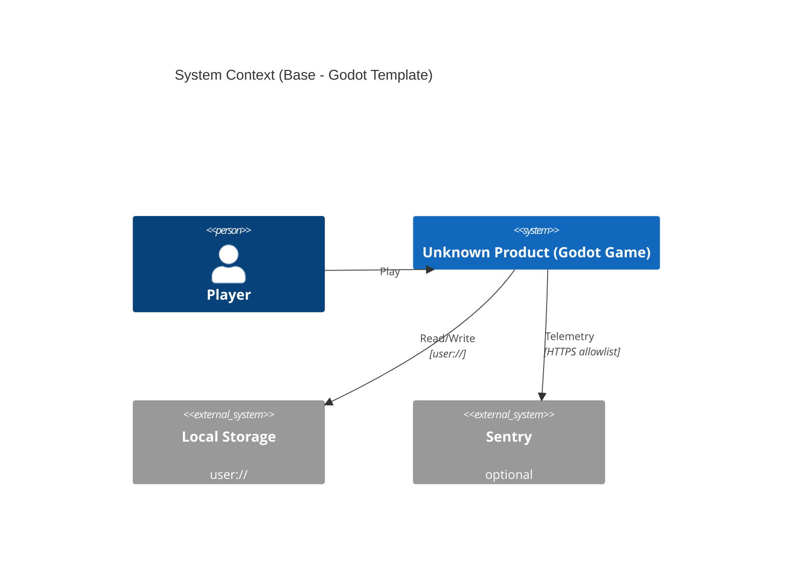
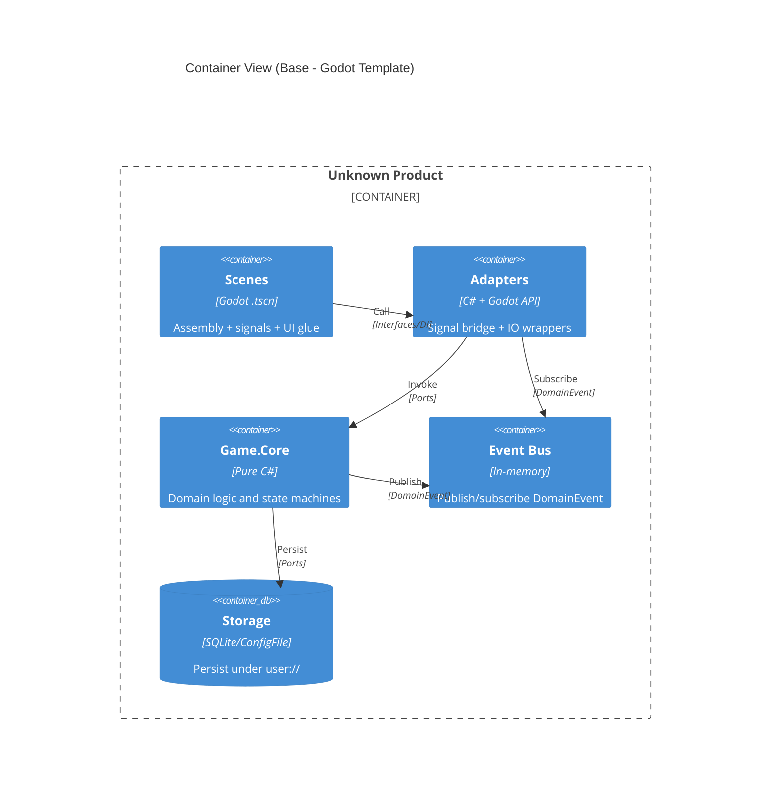
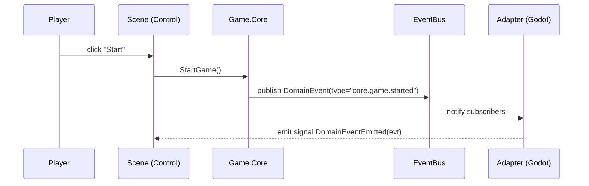

# 04 系统上下文、容器与事件流（Godot + Contracts）

本章提供 Base 级“最小可复用骨架”：系统边界/容器分层/关键事件流。业务细节放在 Overlay 08；Base 只保留契约形态与验收接口。

## 1) System Context（最小）



## 2) Container（最小：Scenes/Adapters/Core）



## 3) 契约（Contracts）与事件命名

### 3.1 DomainEvent（CloudEvents 风格，最小字段）

契约类型的单一事实来源为 `Game.Core/Contracts/**`（见 ADR-0020）。示例结构（与 CloudEvents 1.0 兼容的最小字段集）：

```csharp
namespace Game.Core.Contracts;

public record DomainEvent(
    string Type,
    string Source,
    object? Data,
    DateTime Timestamp,
    string Id,
    string SpecVersion = "1.0",
    string DataContentType = "application/json"
);
```

### 3.2 事件命名（Base 规则）

- 事件类型命名遵循：`${DOMAIN_PREFIX}.<entity>.<action>`
- 推荐前缀（示例口径，详见 ADR-0004）：
  - `core.<entity>.<action>`：领域事件
  - `screen.<name>.<action>`：Screen 生命周期
  - `ui.menu.<action>`：UI 命令/交互

## 4) 关键事件流（示例：按钮点击 -> 领域事件 -> Signal）



## 5) 就地验收（占位接口）

- 领域层（xUnit）：校验事件必填字段/命名规则（不启动引擎）。
- 场景层（GdUnit4）：校验 Signal 贯通（headless）。

