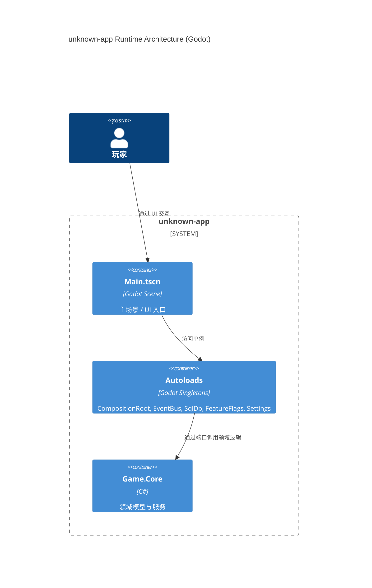
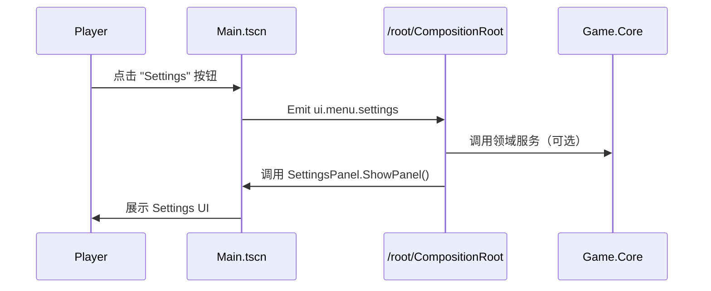

> 目标：从 Godot 场景树与 Autoload 出发，描述运行时主循环、事件流、状态机与错误路径。Base 文档保持引擎中立的抽象，但本变体使用 Godot 4.5 + C# 作为具体背景。

---

## 6.0 运行时总览（C4 容器级）



---

## 6.1 主循环与场景切换

> Godot 负责图形/输入/主循环；我们通过 Autoload 的 CompositionRoot 将 Game.Core 与 Adapters 装配入场景。

- 主场景 `Main.tscn`：
  - 节点：MainMenu、HUD、SettingsPanel 等；
  - 通过 ScreenNavigator 管理 UI 屏幕切换；
  - 关键事件（ui.menu.start/settings/quit）通过 EventBusAdapter 发布。
- Autoloads：
  - CompositionRoot：在 `_Ready` 中创建并注册 ITime/IInput/IResourceLoader/IDataStore/ILogger/IEventBus 端口实例；
  - EventBus：C# + Godot Signals 的组合，为 UI 和领域层提供事件发布/订阅。

运行时主循环简化为：



---

## 6.2 事件总线与错误路径（Godot 变体）

> 事件总线口径见 ADR‑0004；本节强调 Godot 运行时中的错误处理与降级路径。

- EventBusAdapter：
  - 通过 Godot Signals 与 C# 事件桥接，统一发布 `${DOMAIN_PREFIX}.*` 事件；
  - 在 headless + GdUnit4 环境下，事件由测试用例直接订阅与断言，不依赖真实输入。
- 错误路径：
  - 领域层异常 → 在适配层捕获并记录（日志 + 可选事件）；
  - DB 失败（路径非法 / 打开失败 / 执行失败）→ 通过 SqliteDataStore.LastError 与审计日志体现；
  - UI 层异常（SettingsPanel 加载失败等）→ 在 GdUnit4 用例中通过白盒兜底（直接调用 ShowPanel/ClosePanel）确保可测性。

```mermaid
C4Dynamic
    title Settings Event Flow (ui.menu.settings)
    Container(main, "Main.tscn", "Scene")
    Container(bus, "EventBusAdapter", "C# + Godot")
    Container(settings, "SettingsPanel", "C# + Godot")

    Rel(player, main, "click SettingsButton", "input")
    Rel(main, bus, "emit ui.menu.settings", "signal")
    Rel(bus, settings, "ShowPanel() / Load()", "method call")
```

---

## 6.3 状态机与跨重启持久化

> SaveGame/Inventory 的状态机在 Game.Core 中实现；本章只描述运行时骨架。

- SaveGame：
  - 状态：未保存 → 已保存 → 载入中 → 已载入；
  - 事件：`save.requested` / `save.completed` / `load.requested` / `load.completed` / `load.failed`；
  - DB 层通过事务保证“要么全部写入，要么全部回滚”。
- Inventory：
  - 状态：空 → 部分物品 → 替换中 → 稳定；
  - `ReplaceAllAsync` 使用事务，出现错误时回滚，不破坏已有库存。

跨重启流程：

```mermaid
sequenceDiagram
    participant Game as Game.Godot
    participant Db as SqliteDataStore
    participant Repo as SaveGameRepository

    Game->>Db: TryOpen(user://data/game.db)
    Db-->>Game: ok
    Game->>Repo: UpsertAsync(save)
    Note right of Repo: BEGIN TRANSACTION<br/>UPDATE/INSERT<br/>COMMIT
    Game->>Db: Close()
    ... restart ...
    Game->>Db: TryOpen(user://data/game.db)
    Game->>Repo: FindBySlotAsync(user, slot)
    Repo-->>Game: save blob
```

---

## 6.4 Settings 运行时视图（ConfigFile 路径）

> 结合 ADR‑0023，说明 SettingsPanel、ConfigFile 与语言/音量的运行时关系。

- 初次运行：
  - SettingsPanel.Load：先尝试 `ConfigFile.Load(user://settings.cfg)`；
  - 若不存在，则调用迁移逻辑尝试从 DB `settings` 表读取一次并写入 ConfigFile；
  - UI 控件值（音量、画质、语言）从 ConfigFile 恢复并立即应用（音量 → AudioServer，语言 → TranslationServer）。
- 运行中变更：
  - 滑动音量条 → 直接调用 `ApplyVolume()`；
  - 切换语言 → 调用 `TranslationServer.SetLocale(lang)` 并保存到 ConfigFile；
  - 保存按钮：持久化当前设置到 ConfigFile，并再次应用以确保一致性。

相关 GdUnit4 用例：

- `Tests.Godot/tests/UI/test_settings_panel_logic.gd`
- `Tests.Godot/tests/UI/test_settings_locale_persist.gd`
- Integration 场景用例覆盖 Main → SettingsPanel 的事件流。

---

## 6.5 Test-Refs（运行时与错误路径）

- 场景与 Glue：
  - Tests.Godot/tests/Scenes/test_main_scene_smoke.gd
  - Tests.Godot/tests/Scenes/Smoke/test_glue_connections.gd
- UI/Glue：
  - Tests.Godot/tests/UI/test_main_menu_events.gd
  - Tests.Godot/tests/UI/test_hud_updates_on_events.gd
  - Tests.Godot/tests/UI/test_settings_panel_showpanel.gd
  - Tests.Godot/tests/UI/test_settings_panel_closepanel.gd
- DB/持久化：
  - Tests.Godot/tests/Adapters/Db/test_db_persistence_cross_restart.gd
  - Tests.Godot/tests/Adapters/Db/test_savegame_persistence_cross_restart.gd
  - Tests.Godot/tests/Adapters/Db/test_inventory_persistence_cross_restart.gd
- Settings：
  - Tests.Godot/tests/UI/test_settings_panel_logic.gd
  - Tests.Godot/tests/UI/test_settings_locale_persist.gd
